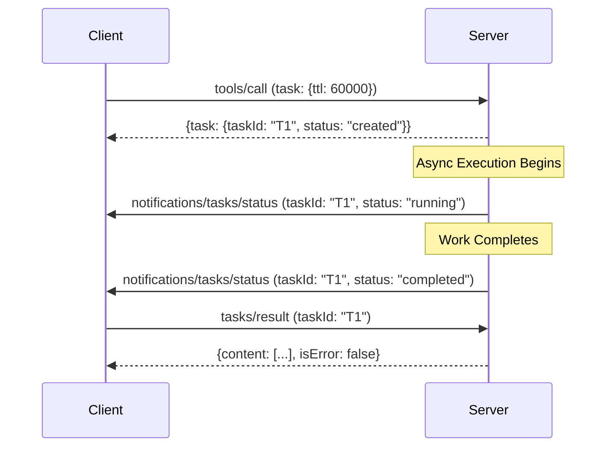

# MCP Tasks: Status State Machine (Experimental)

## Purpose
The `tasks` utility (revision 2025-11-25) introduces asynchronous, long-running operations. This document clarifies the lifecycle of a task and its associated notifications.

## Task Lifecycle States
A task MUST transition through the following states:

1.  **CREATED**: The task has been initialized and assigned a `taskId`. 
    *   Trigger: `tools/call` with `task` params returns a `TaskDescriptor`.
2.  **RUNNING**: The operation is currently in progress.
    *   Notification: `notifications/tasks/status` with `status: "running"`.
3.  **COMPLETED**: The operation finished successfully.
    *   Notification: `notifications/tasks/status` with `status: "completed"`.
    *   Next Step: Requestor calls `tasks/result` to fetch the domain-specific result (e.g., `ToolResult`).
4.  **FAILED**: The operation encountered an error.
    *   Notification: `notifications/tasks/status` with `status: "failed"`.
    *   Result: `tasks/result` will return an error object or `isError: true` in the domain result.
5.  **CANCELLED**: The operation was explicitly terminated by the requestor or receiver.
    *   Trigger: `tasks/cancel` request.
    *   Notification: `notifications/tasks/status` with `status: "cancelled"`.

## Interaction Diagram (tools/call Example)

## Implementation Notes
- **Persistence**: Task state should be stored in a bounded-size TTL cache. Tasks exceeding their TTL MUST be transitioned to `FAILED` or purged.
- **Polling vs Push**: Clients SHOULD NOT poll `tasks/get` aggressively. They MUST rely on `notifications/tasks/status` where the `tasks` capability is negotiated.
- **Race Conditions**: A `tasks/cancel` request might arrive after the task has already entered the `COMPLETED` state. In this case, the server SHOULD return the existing result or a "too late to cancel" error.
