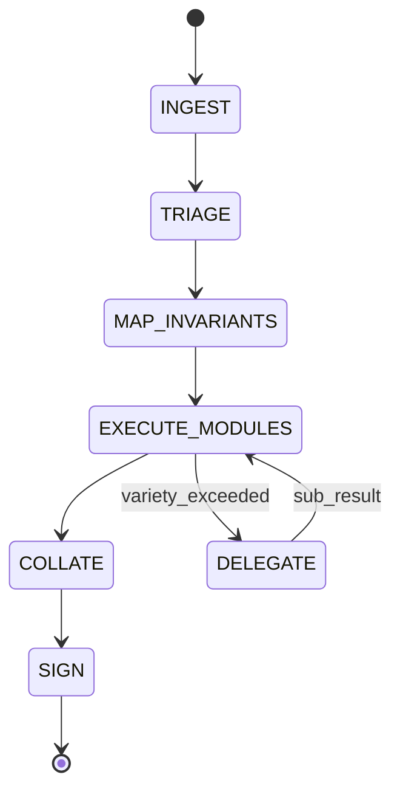

# Rust ChangeSet Assessment Protocol v2.0

```yaml
protocol_id: RUST-REVIEW-A2A
version: 2.0.0
type: executable_specification
inputs: [ChangeSet, PlanOfRecord, CI_Evidence]
outputs: [MergeReceipt | FindingReport]
```

> **Reference**: For comprehensive Rust principles and best practices, see [`documents/skills/rust-standards/SKILL.md`](../rust-standards/SKILL.md).
> **Required Reading**:
> - [Agent-Native Software: Industry Textbook](../agent-native-software/SKILL.md)
> - [Security Documentation](../../security/AGENTS.md)

---

## ChangeSet Assessment Loop



### State: INGEST

```yaml
inputs:
  - pr_url: string
  - head_sha: string
  - diff_chunks: DiffChunk[]
  - crate_manifest: Cargo.toml
  - ci_logs: CI_Log_JSON
  - plan_of_record: TicketRef | null

assertions:
  - ASSERT pr_url IS_VALID_URL
  - ASSERT head_sha MATCHES /^[a-f0-9]{40}$/
  - ASSERT diff_chunks.length > 0

branching:
  IF assertions.any_fail:
    EMIT Finding(INGEST-001, "Invalid ChangeSet metadata")
    GOTO SIGN(FAILED)

exit_criteria:
  - changeset_bundle: ChangeSetBundle
```

### State: TRIAGE

```yaml
inputs:
  - changeset_bundle: ChangeSetBundle

operations:
  - INVOKE references/01_inputs_and_stop_conditions.md
  - INVOKE references/02_qcp_classification.md
  - INVOKE references/03_triage_fast_scan.md

outputs:
  - qcp_score: QCP_Result
  - risk_anchors: RiskAnchor[]
  - stop_conditions: StopCondition[]

branching:
  IF stop_conditions.any_triggered:
    EMIT Finding(TRIAGE-STOP, stop_conditions)
    GOTO SIGN(BLOCKED)

exit_criteria:
  - qcp_score.computed == true
  - risk_anchors.mapped == true
```

### State: MAP_INVARIANTS

```yaml
inputs:
  - changeset_bundle: ChangeSetBundle
  - risk_anchors: RiskAnchor[]

operations:
  - INVOKE references/04_invariant_mapping.md

outputs:
  - invariant_map: InvariantMap

schema InvariantMap:
  entries: Map<TypeSymbol, InvariantEntry>

schema InvariantEntry:
  type_path: string
  invariants:
    - category: REPR | OWNERSHIP | TEMPORAL | FAILURE | CONCURRENCY | PORTABILITY
      predicate: string
      proof_method: TYPE_SYSTEM | TEST | COMMENT | MIRI | LOOM
      proof_location: FilePath:Line | null

exit_criteria:
  - FOR EACH touched_type IN qcp_types:
      invariant_map.has(touched_type) == true
```

### State: EXECUTE_MODULES

```yaml
inputs:
  - changeset_bundle: ChangeSetBundle
  - invariant_map: InvariantMap
  - qcp_score: QCP_Result

operations:
  - PARALLEL:
      - INVOKE references/05_abstraction_and_simplification.md
      - INVOKE references/06_rust_soundness_and_unsafe.md
      - INVOKE references/07_allocator_arena_pool_review.md
      - INVOKE references/08_error_handling_and_panic_policy.md
  - SEQUENTIAL:
      - INVOKE references/09_api_design_and_semver.md
      - INVOKE references/10_testing_evidence_and_ci.md
      - INVOKE references/11_performance_review.md
      - INVOKE references/12_dependency_and_build_surface.md

variety_check:
  IF context_tokens > MAX_TOKENS_PER_CHUNK:
    TRIGGER Sub_Holon_Delegation(chunk_subset)
    AWAIT sub_results
    MERGE sub_results INTO findings

outputs:
  - findings: Finding[]
```

### State: COLLATE

```yaml
inputs:
  - findings: Finding[]

operations:
  - INVOKE references/13_severity_and_verdict.md

outputs:
  - evidence_bundle: EvidenceBundle

schema EvidenceBundle:
  findings: Finding[]
  blocker_count: int
  major_count: int
  minor_count: int
  nit_count: int
  verdict: PASS | FAIL | BLOCKED
```

### State: SIGN

```yaml
inputs:
  - evidence_bundle: EvidenceBundle

branching:
  IF evidence_bundle.blocker_count > 0:
    EMIT FindingReport(verdict=FAIL)
  ELSE IF evidence_bundle.blocked:
    EMIT FindingReport(verdict=BLOCKED)
  ELSE:
    EMIT MergeReceipt(verdict=PASS)

operations:
  - INVOKE references/14_required_actions_templates.md

outputs:
  - receipt: MergeReceipt | FindingReport
```

---

## Finding Schema

```typescript
interface Finding {
  id: FindingID;          // e.g., "RUST-UNSAFE-001"
  location: Location;
  severity: Severity;
  remediation: RemediationConstraint;
  metadata?: FindingMetadata;
}

interface Location {
  file_path: string;
  line: number;
  symbol?: string;
}

type Severity = "BLOCKER" | "MAJOR" | "MINOR" | "NIT";

interface RemediationConstraint {
  type: "CODE" | "TEST" | "DOC" | "CI";
  specification: string;
}

interface FindingMetadata {
  rationale?: string;      // "why" moved here
  references?: string[];
  holonic_constraint?: HolonicViolation;
}

type HolonicViolation =
  | "BOUNDARY_INTEGRITY"   // nondeterminism introduced
  | "VARIETY_EXCEEDED"     // complexity overflow
  | "SECLUSION_BREACH";    // implementation leak
```

---

## Holonic Constraint Checks

Integrated into all Logic Modules:

```yaml
holonic_checks:
  boundary_integrity:
    trigger_patterns:
      - std::time::SystemTime
      - std::time::Instant (in non-test code)
      - rand:: (without deterministic seed)
      - std::env::var
      - std::fs:: (in core logic)
    on_match:
      EMIT Finding(HOLONIC-BOUNDARY-001)

  variety_check:
    threshold: MAX_TOKENS_PER_CHUNK
    on_exceeded:
      TRIGGER Sub_Holon_Delegation

  seclusion_check:
    trigger_patterns:
      - pub field exposing internal repr
      - pub fn returning private type
      - impl detail in pub trait bounds
    on_match:
      EMIT Finding(HOLONIC-SECLUSION-001)
```

---

## Logic Module Index

| Module | File | Domain |
|--------|------|--------|
| M00 | [00_operating_mode.md](references/00_operating_mode.md) | Audit posture |
| M01 | [01_inputs_and_stop_conditions.md](references/01_inputs_and_stop_conditions.md) | Input validation |
| M02 | [02_qcp_classification.md](references/02_qcp_classification.md) | QCP scoring |
| M03 | [03_triage_fast_scan.md](references/03_triage_fast_scan.md) | Risk detection |
| M04 | [04_invariant_mapping.md](references/04_invariant_mapping.md) | Invariant extraction |
| M05 | [05_abstraction_and_simplification.md](references/05_abstraction_and_simplification.md) | Design quality |
| M06 | [06_rust_soundness_and_unsafe.md](references/06_rust_soundness_and_unsafe.md) | Memory safety |
| M07 | [07_allocator_arena_pool_review.md](references/07_allocator_arena_pool_review.md) | Allocator audit |
| M08 | [08_error_handling_and_panic_policy.md](references/08_error_handling_and_panic_policy.md) | Failure semantics |
| M09 | [09_api_design_and_semver.md](references/09_api_design_and_semver.md) | API + MSRV |
| M10 | [10_testing_evidence_and_ci.md](references/10_testing_evidence_and_ci.md) | Test + CI |
| M11 | [11_performance_review.md](references/11_performance_review.md) | Performance |
| M12 | [12_dependency_and_build_surface.md](references/12_dependency_and_build_surface.md) | Supply chain |
| M13 | [13_severity_and_verdict.md](references/13_severity_and_verdict.md) | Verdict reducer |
| M14 | [14_required_actions_templates.md](references/14_required_actions_templates.md) | Output actions |

---

## Resource Budgets

```yaml
operational_envelopes:
  MAX_TOKENS_PER_CHUNK: 8000
  MAX_RETRIES_PER_GATE: 2
  MAX_SUBHOLON_DEPTH: 3
  TIMEOUT_PER_MODULE_MS: 30000
```
