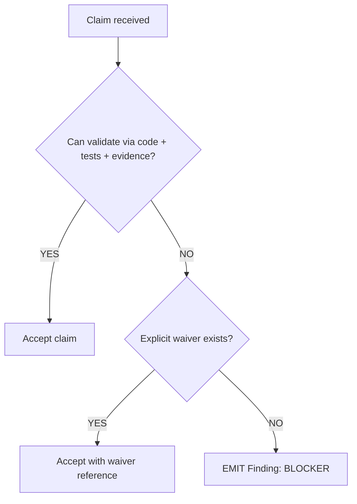

# M00: Operating Mode

```yaml
module_id: M00
domain: audit_posture
inputs: [ChangeSetBundle, ReviewerContext]
outputs: [AuditConfig]
```

---

## Configuration State

```yaml
audit_config:
  trust_model:
    implementer_commentary: NON_BINDING
    truth_sources:
      - diff_content
      - surrounding_code
      - binding_requirements  # tickets, specs, standards
      - ci_evidence           # logs, artifacts, checks

  execution_model:
    local_execution: DISABLED
    reason: "Avoid executing untrusted build scripts, proc macros, tests"

  allowed_local_actions:
    - file_read
    - static_inspection
    - gh_cli_readonly
    - text_search_non_build

  optional_local_execution:
    preconditions:
      - hermetic: true
      - ephemeral: true
      - secretless: true
      - network_restricted: true
    authority: SUPPLEMENTARY  # CI remains authoritative
```

---

## Decision Rules



---

## Re-Audit Protocol

```yaml
re_audit:
  trigger:
    condition: "QCP == YES AND fixes_applied == true"

  procedure:
    - focus: [remediation_correctness, regression_risk]
    - scope: changed_files_since_last_review
    - inherit: previous_finding_ids

  output:
    type: ReAuditResult
    fields:
      - findings_resolved: FindingID[]
      - findings_new: Finding[]
      - findings_regressed: FindingID[]
```

---

## Assertions

```yaml
assertions:
  - id: M00-001
    predicate: "reviewer.trust_model == INDEPENDENT"
    on_fail: null  # configuration, not finding

  - id: M00-002
    predicate: "local_execution == DISABLED OR sandbox.valid"
    on_fail: null  # configuration
```
