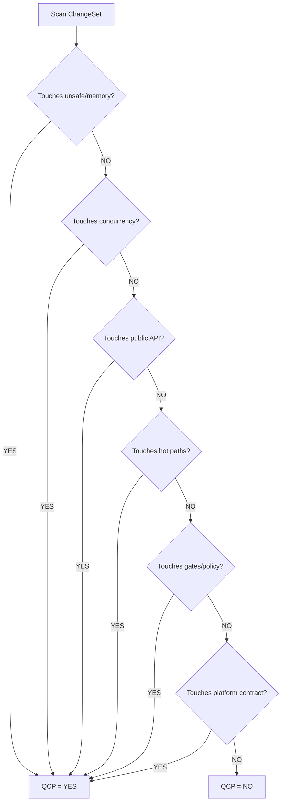

# M02: QCP Classification

```yaml
module_id: M02
domain: risk_classification
inputs: [ChangeSetBundle]
outputs: [QCP_Result]
```

---

## QCP Decision Tree



---

## QCP Trigger Patterns

### 1.1 Soundness and Memory Correctness

```yaml
patterns:
  - regex: "\\bunsafe\\b"
  - regex: "\\bunsafe\\s+fn\\b"
  - regex: "\\bunsafe\\s+impl\\b"
  - symbols: [NonNull, UnsafeCell, MaybeUninit, ManuallyDrop]
  - symbols: ["mem::forget", "mem::transmute", "mem::zeroed"]
  - keywords: [arena, pool, freelist, slab, allocator]
  - symbols: [Pin]

on_match:
  qcp: true
  category: SOUNDNESS_MEMORY
```

### 1.2 Concurrency Correctness

```yaml
patterns:
  - traits: [Send, Sync]
  - regex: "\\bunsafe\\s+impl\\s+(Send|Sync)\\b"
  - symbols: [Atomic*, Ordering, fence]
  - keywords: [lock-free, lockfree]
  - context: "async cancellation"
  - context: "locks in async"

on_match:
  qcp: true
  category: CONCURRENCY
```

### 1.3 Public API Contract

```yaml
patterns:
  - visibility: pub
  - change_type: [added, modified, removed]
  - scope: [type, trait, function, const, static]
  - feature_flag_changes: true
  - serialization_format_changes: true

on_match:
  qcp: true
  category: PUBLIC_API
```

### 1.4 Performance-Critical Surfaces

```yaml
patterns:
  - annotation: "#[inline]"
  - annotation: "#[cold]"
  - annotation: "#[hot]"
  - path_contains: [alloc, dealloc, index, iter, traverse]
  - complexity_change: true
  - allocation_pattern_change: true

on_match:
  qcp: true
  category: PERFORMANCE
```

### 1.5 Gate and Policy Surfaces

```yaml
patterns:
  - path_contains: [.github/workflows, ci.yml, ci.yaml]
  - path_contains: [clippy.toml, rustfmt.toml, deny.toml]
  - cfg_change: "feature gate"
  - lint_suppression: true

on_match:
  qcp: true
  category: GATE_POLICY
```

### 1.6 Platform / `no_std` Contract

```yaml
contract_promises:
  - no_std_support: "#![no_std]"
  - alloc_only: "extern crate alloc"
  - target_families: [embedded, wasm, "target_os = none"]
  - pointer_width_portable: ["target_pointer_width = 32", "target_pointer_width = 64"]
  - endianness_portable: true

trigger_patterns:
  - new_std_usage: "std::"
  - uncovered_cfg: "cfg(...) without CI"
  - pointer_width_assumption: ["usize as u64", "usize as u32"]
  - endianness_assumption: "repr(C) + byte manipulation"

assertions:
  - id: QCP-NOSTD-001
    predicate: |
      IF contract.no_std_support THEN
        NOT diff.contains_unconditional_std_usage
    on_fail:
      EMIT Finding:
        id: QCP-NOSTD-001
        severity: BLOCKER
        location: {first_std_usage}
        remediation:
          type: CODE
          specification: "Gate std usage with cfg(feature = \"std\")"

  - id: QCP-PTR-001
    predicate: |
      IF contract.pointer_width_portable THEN
        NOT diff.contains_unguarded_pointer_width_cast
    on_fail:
      EMIT Finding:
        id: QCP-PTR-001
        severity: BLOCKER
        location: {cast_location}
        remediation:
          type: CODE
          specification: "Add cfg(target_pointer_width) guards"

  - id: QCP-LAYOUT-001
    predicate: |
      IF diff.modifies_repr_c THEN
        endianness_documented AND tests_exist
    on_fail:
      EMIT Finding:
        id: QCP-LAYOUT-001
        severity: BLOCKER
        location: {repr_location}
        remediation:
          type: TEST
          specification: "Add endianness tests for layout-sensitive code"
```

---

## Output Schema

```typescript
interface QCP_Result {
  qcp: boolean;
  categories: QCPCategory[];
  justification: string;
  threshold_multiplier: number;  // 1.0 for NO, 2.0 for YES
}

type QCPCategory =
  | "SOUNDNESS_MEMORY"
  | "CONCURRENCY"
  | "PUBLIC_API"
  | "PERFORMANCE"
  | "GATE_POLICY"
  | "PLATFORM_CONTRACT";
```

---

## QCP Implications

```yaml
if_qcp_yes:
  proof_burden: ELEVATED
  severity_threshold: STRICT  # MAJOR -> presumptive BLOCKER
  re_audit: MANDATORY_AFTER_FIXES
```
