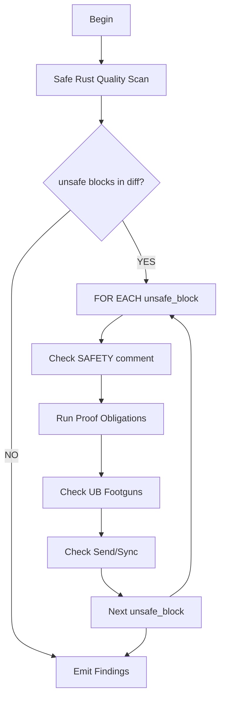

# M06: Rust Soundness and Unsafe

```yaml
module_id: M06
domain: memory_safety
inputs: [ChangeSetBundle, InvariantMap]
outputs: [Finding[]]
```

---

## Review Protocol



---

## State: Safe Rust Quality Scan

```yaml
assertions:
  - id: SAFE-OWN
    predicate: "ownership boundaries obvious and type-enforced"
    on_fail:
      severity: MAJOR
      remediation: "Clarify ownership with types"

  - id: SAFE-LIFE
    predicate: "lifetimes prevent use-after-free by construction"
    on_fail:
      severity: MAJOR
      remediation: "Tighten lifetime bounds"

  - id: SAFE-INV
    predicate: "invariants as types, not comments"
    on_fail:
      severity: MINOR
      remediation: "Consider newtype wrappers"

red_flags:
  - id: SAFE-LEAK
    pattern: "leaky lifetimes encouraging unsafe downstream"
    severity: MAJOR

  - id: SAFE-CLONE
    pattern: "excessive cloning as borrow-checker workaround"
    severity: MINOR

  - id: SAFE-INTERIOR
    pattern: "hidden interior mutability causing aliasing/reentrancy"
    severity: MAJOR
```

---

## State: Unsafe Block Structure Check

```yaml
FOR EACH unsafe_block IN diff:

  assertion_1:
    id: UNSAFE-SCOPE
    predicate: "unsafe isolated to smallest scope"
    on_fail:
      EMIT Finding:
        id: RUST-UNSAFE-SCOPE
        severity: MAJOR
        location: {unsafe_block.location}
        remediation:
          type: CODE
          specification: "Reduce unsafe scope to minimal necessary"

  assertion_2:
    id: UNSAFE-COMMENT
    predicate: "// SAFETY: comment exists adjacent to unsafe"
    on_fail:
      EMIT Finding:
        id: RUST-UNSAFE-001
        severity: BLOCKER
        location: {unsafe_block.location}
        remediation:
          type: DOC
          specification: |
            Add // SAFETY: comment stating:
            1. The invariant(s)
            2. Why the invariant holds at this callsite
            3. What would make it unsound

  assertion_3:
    id: UNSAFE-QUALITY
    predicate: |
      safety_comment.mentions(aliasing OR lifetimes OR validity)
      AND NOT safety_comment.is_trivial("because it works")
    on_fail:
      EMIT Finding:
        id: RUST-UNSAFE-002
        severity: BLOCKER
        location: {unsafe_block.location}
        remediation:
          type: DOC
          specification: "Safety comment must address aliasing, lifetimes, or validity"

  assertion_4:
    id: UNSAFE-SCP
    predicate: |
      IF is_scp_path THEN
        justification.is_extraordinary() AND tested_with_miri
    on_fail:
      EMIT Finding:
        id: RUST-UNSAFE-SCP
        severity: CRITICAL
        location: {unsafe_block.location}
        remediation:
          type: CODE
          specification: "Unsafe in SCP must be proven necessary and defended by Miri/Fuzz tests"
```

---

## State: Proof Obligations Checklist

```yaml
FOR EACH unsafe_block:
  RUN proof_obligations:

  - id: PROOF-PTR-VALID
    question: "Is pointer non-null?"
    check: "explicit null check OR NonNull type"
    on_fail: BLOCKER

  - id: PROOF-PTR-INIT
    question: "Points to initialized memory?"
    check: "initialization proof OR MaybeUninit discipline"
    on_fail: BLOCKER

  - id: PROOF-PTR-ALIVE
    question: "Pointed object alive for access duration?"
    check: "lifetime bound OR documented scope"
    on_fail: BLOCKER

  - id: PROOF-ALIGN
    question: "Pointer aligned for T?"
    check: "alignment guarantee OR packed handling"
    on_fail: BLOCKER

  - id: PROOF-ALIAS
    question: "No simultaneous mutable aliases?"
    check: "exclusive access proof"
    on_fail: BLOCKER

  - id: PROOF-SHARED
    question: "No shared refs during mutation?"
    check: "borrow discipline"
    on_fail: BLOCKER

  - id: PROOF-PROV
    question: "Pointer from valid allocation?"
    check: "provenance chain documented"
    on_fail: BLOCKER

  - id: PROOF-CAST
    question: "Integer casts preserve provenance?"
    check: "no ptr->int->ptr roundtrip OR strict provenance"
    on_fail: MAJOR

  - id: PROOF-BOUNDS
    question: "Slice length correct, no overflow?"
    check: "checked arithmetic for len * size_of::<T>()"
    on_fail: BLOCKER

  - id: PROOF-DROP
    question: "Drop invoked exactly once?"
    check: "drop discipline documented"
    on_fail: BLOCKER

  - id: PROOF-PARTIAL
    question: "Partial init handled?"
    check: "partial init states documented"
    on_fail: MAJOR

  - id: PROOF-UNWIND
    question: "Panic preserves invariants?"
    check: "unwind safety analysis"
    on_fail: MAJOR

  - id: PROOF-LEAK
    question: "Memory leaked safely, not corrupted?"
    check: "leak-on-panic acceptable"
    on_fail: MAJOR

qcp_rule:
  IF qcp == YES AND any_proof_unanswered:
    severity: BLOCKER
```

---

## State: UB Footgun Detection

```yaml
high_suspicion_patterns:
  - id: UB-TRANSMUTE
    pattern: "mem::transmute"
    severity: BLOCKER
    justification_required: "Explain why explicit conversion insufficient"
    remediation: "Use explicit conversion or bytemuck"

  - id: UB-ZEROED
    pattern: "mem::zeroed for non-zeroable"
    severity: BLOCKER
    remediation: "Use MaybeUninit or explicit initialization"

  - id: UB-PACKED
    pattern: "repr(packed)"
    severity: BLOCKER
    justification_required: "Creates unaligned reference hazards"
    remediation: "Use raw pointers or copy to aligned buffer"

  - id: UB-SETLEN
    pattern: "Vec::set_len"
    severity: BLOCKER
    proof_required: "Rigorous initialization proof"
    remediation: "Document initialization of all elements"

  - id: UB-ASSUME
    pattern: "MaybeUninit::assume_init"
    severity: BLOCKER
    proof_required: "Exhaustive initialization proof"

  - id: UB-RAWOPS
    pattern: "ptr::read|ptr::write|copy_nonoverlapping"
    severity: BLOCKER
    proof_required: "Aliasing and bounds proof"

  - id: UB-MANUAL
    pattern: "ManuallyDrop"
    severity: MAJOR
    proof_required: "Single-drop discipline"

  - id: UB-STATIC
    pattern: "static mut"
    severity: BLOCKER
    remediation: "Use atomic or Mutex; static mut almost never acceptable"
```

---

## State: Send/Sync Correctness

```yaml
assertions:
  - id: SEND-IMPL
    predicate: |
      IF unsafe impl Send THEN
        explicit_concurrency_invariant_comment EXISTS
    on_fail:
      EMIT Finding:
        id: RUST-SEND-001
        severity: BLOCKER
        remediation:
          type: DOC
          specification: "Add concurrency safety invariant comment"

  - id: SYNC-IMPL
    predicate: |
      IF unsafe impl Sync THEN
        explicit_concurrency_invariant_comment EXISTS
    on_fail:
      EMIT Finding:
        id: RUST-SYNC-001
        severity: BLOCKER
        remediation:
          type: DOC
          specification: "Add concurrency safety invariant comment"

  - id: THREAD-MUT
    predicate: "NOT exposes &mut T or *mut T across threads without sync"
    on_fail:
      EMIT Finding:
        id: RUST-THREAD-001
        severity: BLOCKER
        remediation:
          type: CODE
          specification: "Add synchronization primitive"

  - id: INTERIOR-MT
    predicate: |
      IF interior_mutability AND multi_threaded_context THEN
        atomic_or_lock_discipline EXISTS
    on_fail:
      EMIT Finding:
        id: RUST-INTERIOR-001
        severity: BLOCKER
        remediation:
          type: CODE
          specification: "Use Atomic* or Mutex for thread-safe interior mutability"

test_requirements:
  IF concurrency_invariants.non_trivial:
    require: "loom tests OR explicit thread-safety documentation"
```

---

## Output Schema

```typescript
interface SoundnessFinding extends Finding {
  proof_obligation?: ProofObligation;
  ub_pattern?: UBPattern;
}

type ProofObligation =
  | "PTR_VALID"
  | "PTR_INIT"
  | "PTR_ALIVE"
  | "ALIGN"
  | "ALIAS"
  | "SHARED"
  | "PROV"
  | "BOUNDS"
  | "DROP"
  | "UNWIND";

type UBPattern =
  | "TRANSMUTE"
  | "ZEROED"
  | "PACKED"
  | "SET_LEN"
  | "ASSUME_INIT"
  | "RAW_OPS"
  | "MANUAL_DROP"
  | "STATIC_MUT";
```

---

## Unsafe Block Review Template

```yaml
FOR EACH unsafe_block:
  document:
    location: "file:line"
    operation: "what unsafe operation is performed"
    invariants_required: "list of preconditions"
    invariants_hold_because: "proof reasoning"
    defended_by: "test name OR doc location"
    regression_risks: "what changes would break this"

  rule:
    IF any_field_unanswered AND qcp == YES:
      severity: BLOCKER
```
