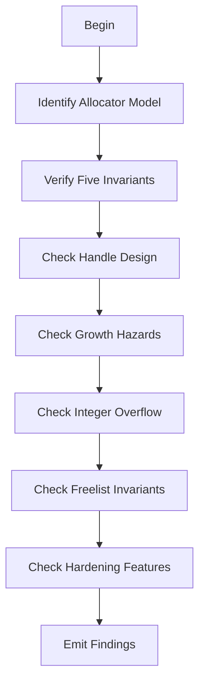

# M07: Allocator/Arena/Pool Review

```yaml
module_id: M07
domain: memory_management
inputs: [ChangeSetBundle, InvariantMap]
outputs: [Finding[]]
precondition: diff.touches(arena|pool|freelist|slab|allocator)
```

---

## Review Protocol



---

## State: Identify Allocator Model

```yaml
models:
  BUMP_ARENA:
    description: "Monotonic allocation; free via arena reset"
    key_invariant: "No individual deallocation"

  POOL_ALLOCATOR:
    description: "Fixed-size blocks; reuse via freelist"
    key_invariant: "Block size uniformity"

  SLAB_ALLOCATOR:
    description: "Index-based handles into slab storage"
    key_invariant: "Handle validity"

  GENERATIONAL_INDEX:
    description: "Generation counters prevent stale handle use"
    key_invariant: "Generation monotonicity"

  TYPED_ARENA:
    description: "Stores T with drop semantics"
    key_invariant: "Drop correctness"

  UNTYPED_ARENA:
    description: "Raw bytes, layout-managed"
    key_invariant: "Layout correctness"

required_documentation:
  - what_is_allocated: Type
  - how_referenced: "pointer | reference | index | handle"
  - when_reclaimed: "individual | reset | drop"
  - stability_guarantee: "stable across growth OR not"
```

---

## State: Five Allocator Invariants

```yaml
FOR EACH allocator_type:
  CHECK invariants:

  - id: ALLOC-UAF
    name: "No use-after-free by construction"
    predicate: |
      safe_api CANNOT retrieve reference after freed/reset
      OR api_is_unsafe WITH documented safety requirements
    on_fail:
      EMIT Finding:
        id: ALLOC-UAF-001
        severity: BLOCKER
        remediation:
          type: CODE
          specification: "Prevent UAF via lifetime binding or unsafe marker"

  - id: ALLOC-DOUBLE
    name: "No double-free"
    predicate: |
      each_allocation returned_to_pool AT_MOST_ONCE
      AND freelist_rejects_duplicates
    on_fail:
      EMIT Finding:
        id: ALLOC-DOUBLE-001
        severity: BLOCKER
        remediation:
          type: CODE
          specification: "Add duplicate detection or ownership discipline"

  - id: ALLOC-ALIGN
    name: "Correct alignment"
    predicate: |
      returned_allocations MEET Layout.alignment
      AND internal_storage RESPECTS alignment FOR_ALL T
    on_fail:
      EMIT Finding:
        id: ALLOC-ALIGN-001
        severity: BLOCKER
        remediation:
          type: CODE
          specification: "Ensure alignment via Layout or align_to"

  - id: ALLOC-OVERLAP
    name: "No overlapping allocations"
    predicate: "two live allocations NEVER overlap in memory"
    on_fail:
      EMIT Finding:
        id: ALLOC-OVERLAP-001
        severity: BLOCKER
        remediation:
          type: CODE
          specification: "Fix allocation bookkeeping"

  - id: ALLOC-DROP
    name: "Drop discipline"
    predicate: |
      values_requiring_drop ARE dropped_exactly_once
      AND uninitialized_values ARE_NOT dropped
      AND arena_reset RESPECTS drop_semantics OR_IS documented
    on_fail:
      EMIT Finding:
        id: ALLOC-DROP-001
        severity: BLOCKER
        remediation:
          type: CODE
          specification: "Document and enforce drop discipline"
```

---

## State: Handle Design Check

```yaml
IF allocator.uses_handles:
  assertions:
    - id: HANDLE-GEN
      predicate: |
        IF stale_use_plausible THEN
          generational_handles USED
      on_fail:
        severity: MAJOR
        remediation: "Add generation counters"

    - id: HANDLE-BOUNDS
      predicate: "bounds check at every dereference"
      on_fail:
        severity: BLOCKER
        remediation: "Add bounds checking"

    - id: HANDLE-STALE
      predicate: "stale check at every dereference"
      on_fail:
        severity: BLOCKER
        remediation: "Add generation/validity check"

    - id: HANDLE-DEBUG
      predicate: "Debug/Display do not leak raw pointers"
      on_fail:
        severity: MINOR
        remediation: "Redact pointers in debug output"

IF allocator.returns_references:
  assertions:
    - id: REF-LIFETIME
      predicate: "lifetimes tie reference to arena borrow"
      on_fail:
        severity: BLOCKER

    - id: REF-MUTATE
      predicate: |
        arena_mutation CANNOT invalidate existing_references
        OR api_prevents_mutation_while_refs_exist
      on_fail:
        severity: BLOCKER
        remediation: "Use shared borrow or redesign API"
```

---

## State: Growth and Relocation Hazards

```yaml
IF storage.can_grow:
  assertions:
    - id: GROW-STABLE
      predicate: |
        IF pointer_stability_promised THEN
          backing_storage IS non_moving
      valid_non_moving:
        - "Vec<Box<[T]>> chunked"
        - "Vec<NonNull<u8>> blocks"
        - "stable slabs"
      on_fail:
        EMIT Finding:
          id: ALLOC-GROW-001
          severity: BLOCKER
          remediation:
            type: CODE
            specification: |
              Use non-moving backing store OR
              remove pointer stability promise
```

---

## State: Integer Overflow Check

```yaml
overflow_checks:
  - id: OVERFLOW-MUL
    pattern: "len * size_of::<T>()"
    predicate: "uses checked_mul or saturating_mul"
    on_fail:
      severity: BLOCKER
      remediation: "Use checked arithmetic"

  - id: OVERFLOW-LAYOUT
    pattern: "Layout::from_size_align"
    predicate: "validates size and alignment bounds"
    on_fail:
      severity: BLOCKER
      remediation: "Add Layout validation"

  - id: OVERFLOW-MAX
    pattern: "size computation from external input"
    predicate: |
      explicit_maximum_documented OR
      usize_limits_relied_upon_with_doc
    on_fail:
      severity: BLOCKER
      remediation: "Document size limits and validate inputs"
```

---

## State: Freelist Invariants

```yaml
IF freelist.exists:
  required_checks:
    - id: FREE-NODE
      check: "node representation documented (embedded vs separate)"

    - id: FREE-CONSISTENT
      check: "freelist updates consistent across all paths"

    - id: FREE-CYCLE
      check: "no cycles in freelist"
      on_fail: BLOCKER

    - id: FREE-DUP
      check: "no duplicate insertion"
      on_fail: BLOCKER

    - id: FREE-DANGLE
      check: "no dangling pointers in freelist"
      on_fail: BLOCKER

    - id: FREE-ABA
      predicate: |
        IF lock_free THEN
          aba_protection_exists
      on_fail: BLOCKER

  IF lock_free:
    require:
      - "explicit memory ordering rationale"
      - "loom tests OR equivalent"
```

---

## State: Hardening Features

```yaml
recommendations:
  - id: HARD-POISON
    feature: "debug-mode poisoning of freed blocks"
    priority: RECOMMENDED

  - id: HARD-CANARY
    feature: "optional canaries / bounds markers"
    priority: OPTIONAL

  - id: HARD-ASSERT
    feature: "invariant assertions behind feature flag"
    priority: RECOMMENDED

qcp_escalation:
  IF qcp == YES AND defects_likely:
    recommendations -> requirements
```

---

## Output Schema

```typescript
interface AllocatorFinding extends Finding {
  invariant_violated?: AllocatorInvariant;
  allocator_model?: AllocatorModel;
}

type AllocatorInvariant =
  | "NO_UAF"
  | "NO_DOUBLE_FREE"
  | "CORRECT_ALIGNMENT"
  | "NO_OVERLAP"
  | "DROP_DISCIPLINE";

type AllocatorModel =
  | "BUMP_ARENA"
  | "POOL_ALLOCATOR"
  | "SLAB_ALLOCATOR"
  | "GENERATIONAL_INDEX"
  | "TYPED_ARENA"
  | "UNTYPED_ARENA";
```

---

## Allocator Test Requirements

```yaml
required_test_coverage:
  - id: ATEST-DISTINCT
    test: "Allocate N objects, verify distinctness and correct alignment"

  - id: ATEST-REUSE
    test: "Free in random order, reallocate, verify reuse semantics"
    condition: "if reuse promised"

  - id: ATEST-RESET
    test: "Reset arena, verify handles invalid AND drops executed"
    checks:
      - handles_invalidated: true
      - drops_exactly_once: true

  - id: ATEST-MODEL
    test: "Compare allocator state against reference model after each op"
    reference_models:
      slab: "Vec<Option<T>>"
      pool: "HashSet<AllocId>"

  - id: ATEST-STRESS
    test: "Randomized operation sequences with fixed seed"
    property: deterministic_replay

  - id: ATEST-MIRI
    test: "Miri CI job covers representative scenarios"
    condition: "if unsafe code present"
```
