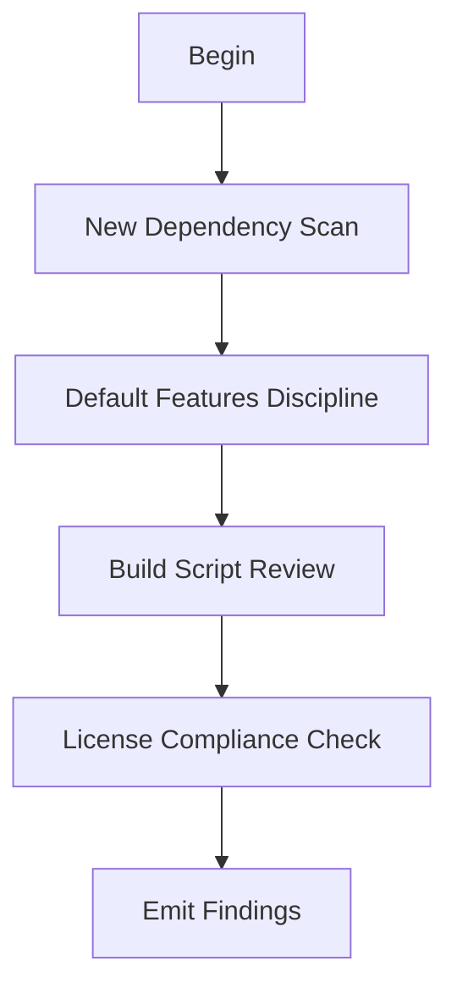

# M12: Dependency and Build Surface

```yaml
module_id: M12
domain: supply_chain
inputs: [ChangeSetBundle]
outputs: [Finding[]]
```

---

## Review Protocol



---

## State: New Dependency Scan

```yaml
IF diff.adds_dependency:
  requirements:
    - id: DEP-JUSTIFY
      predicate: "justification provided"
      on_fail:
        severity: MAJOR
        remediation: "Document why dependency is needed"

    - id: DEP-ALT
      predicate: "alternatives analysis provided"
      on_fail:
        severity: MINOR
        remediation: "Document considered alternatives"

    - id: DEP-PROC
      predicate: |
        IF dependency.is_proc_macro OR dependency.has_build_script THEN
          elevated_risk_acknowledged
      on_fail:
        severity: MAJOR
        remediation: "Acknowledge elevated risk of proc-macro/build deps"

  checks:
    - default_features_pull_heavy: "unnecessary bloat?"
    - proc_macro_deps: "elevated risk"
    - build_script_deps: "elevated risk"
```

---

## State: Default Features Discipline

```yaml
for_foundational_crates:
  requirements:
    - id: DEP-DEFAULT
      predicate: |
        IF enables_default_features THEN
          justification_documented
      on_fail:
        EMIT Finding:
          id: DEP-DEFAULT-001
          severity: MAJOR
          remediation:
            type: DOC
            specification: "Justify default features or use default-features = false"

  rationale:
    - "Default features often pull in std"
    - "Default features add code weight"
    - "Default features may add license obligations"

  recommended_pattern:
    cargo_toml: |
      [dependencies]
      foo = { version = "1.0", default-features = false, features = ["needed"] }
```

---

## State: Build Script and Proc-Macro Review

```yaml
IF diff.adds_or_modifies(build.rs | proc_macro):
  auto_qcp: true

  requirements:
    - id: BUILD-SCOPE
      predicate: "tight scoping and clear reasoning"
      on_fail:
        severity: MAJOR
        remediation: "Minimize build script scope"

    - id: BUILD-DETERM
      predicate: "pure Rust, deterministic, no network"
      on_fail:
        EMIT Finding:
          id: BUILD-DETERM-001
          severity: BLOCKER
          holonic_constraint: BOUNDARY_INTEGRITY
          remediation:
            type: CODE
            specification: "Remove network/nondeterministic operations"

    - id: BUILD-DOCS
      predicate: "generated artifacts documented"
      on_fail:
        severity: MAJOR
        remediation: "Document what build script generates"
```

---

## State: License Compliance Check

```yaml
policy:
  merge_gating: true
  tool_enforced: true

preferred_tool: cargo-deny
  config: deny.toml
  requirements:
    - license_allowlist: defined
    - unknown_denied: true
    - transitive_covered: true

procedure:
  IF ci_runs_cargo_deny:
    - verify: "check exists and passed"
    - verify: "runs under --all-features"
  ELSE:
    EMIT Finding:
      id: LICENSE-001
      severity: BLOCKER
      remediation:
        type: CI
        specification: |
          Add cargo-deny with license allowlist
          OR implement equivalent license verification

feature_flag_rule:
  - id: LICENSE-FEATURE
    predicate: "license checks run under --all-features"
    rationale: "Feature flags can pull in additional deps"
    on_fail:
      severity: MAJOR
      remediation: "Run license checks with --all-features"

edge_cases:
  dual_licensing:
    patterns: [OpenSSL, SSLeay, AGPL]
    requirement: "explicitly addressed in policy"

  build_deps:
    note: "build-dependencies and dev-dependencies may have different requirements"
    requirement: "policy must be explicit"
```

---

## Output Schema

```typescript
interface DependencyFinding extends Finding {
  dependency_issue?: DependencyIssue;
  license_issue?: LicenseIssue;
  build_issue?: BuildIssue;
}

type DependencyIssue =
  | "UNJUSTIFIED"
  | "NO_ALTERNATIVES_ANALYSIS"
  | "HEAVY_DEFAULTS"
  | "ELEVATED_RISK";

type LicenseIssue =
  | "NO_VERIFICATION"
  | "INCOMPATIBLE"
  | "UNKNOWN"
  | "FEATURE_UNCOVERED";

type BuildIssue =
  | "NONDETERMINISTIC"
  | "NETWORK_ACCESS"
  | "UNDOCUMENTED_OUTPUT";
```
