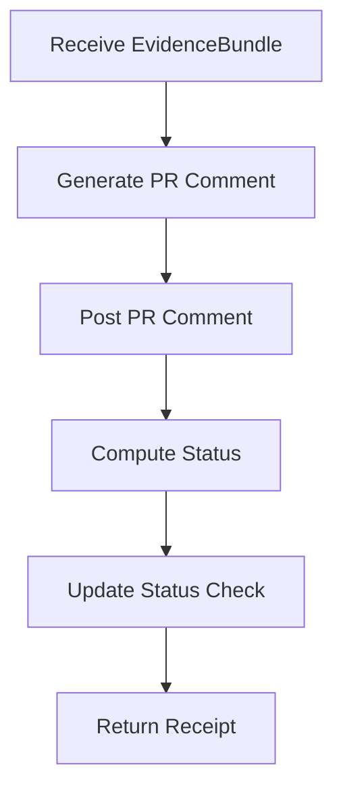

# M14: Required Actions

```yaml
module_id: M14
domain: output_actions
inputs: [EvidenceBundle, PR_URL, HEAD_SHA]
outputs: [PRComment, StatusCheck]
```

---

## Action Sequence



---

## Action 1: Post PR Comment

```yaml
command_template: |
  gh pr comment $PR_URL --body "$(cat <<'EOF'
  ## Code Quality Review

  **QCP:** {qcp_status} — {qcp_justification}

  **Scope Reviewed:**
  - Subsystems: {subsystems}
  - Public API changes: {public_api_changes}
  - Unsafe/Concurrency/Performance: {qcp_surfaces}

  **Evidence Verified (CI):**
  - Checks passed: {ci_checks}
  - Coverage gaps: {coverage_gaps}

  **Findings:**
  {findings_formatted}

  **Positive Observations:**
  {positive_observations}

  **Verdict:** {verdict}
  EOF
  )"

findings_format:
  FOR EACH finding:
    template: |
      - **[{severity}]** `{location}`
        - Issue: {issue_description}
        - Required remediation: {remediation}
        - Proof requirement: {proof_type}

rules:
  - proof_required_for: [BLOCKER, MAJOR]
  - failure_reason_explicit: true
  - failure_reason_minimal: true
```

---

## Action 2: Update Status Check

```yaml
status_decision:
  IF verdict == PASS:
    state: success
    description: "Code quality review passed"

  ELSE IF verdict == FAIL:
    state: failure
    description: "Code quality review found issues - see PR comments"

  ELSE IF verdict == BLOCKED:
    state: pending
    description: "Code quality review blocked - see PR comments"

command_templates:
  success: |
    gh api --method POST "/repos/{owner}/{repo}/statuses/$HEAD_SHA" \
      -f state="success" \
      -f context="ai-review/code-quality" \
      -f description="Code quality review passed"

  failure: |
    gh api --method POST "/repos/{owner}/{repo}/statuses/$HEAD_SHA" \
      -f state="failure" \
      -f context="ai-review/code-quality" \
      -f description="Code quality review found issues - see PR comments"

  blocked: |
    gh api --method POST "/repos/{owner}/{repo}/statuses/$HEAD_SHA" \
      -f state="pending" \
      -f context="ai-review/code-quality" \
      -f description="Code quality review blocked - see PR comments"
```

---

## Execution Protocol

```yaml
execution_order:
  1. post_pr_comment:
     required: true
     purpose: "actionable record for author"

  2. update_status_check:
     required: true
     purpose: "merge gate"

invariants:
  - both_commands_executed: true
  - pr_comment_is_record: true
  - status_check_is_gate: true
```

---

## Output Receipt

```yaml
receipt_schema:
  type: MergeReceipt | FindingReport

  MergeReceipt:
    verdict: PASS
    pr_url: string
    head_sha: string
    evidence_bundle_digest: string
    timestamp: ISO8601

  FindingReport:
    verdict: FAIL | BLOCKED
    pr_url: string
    head_sha: string
    blocker_count: int
    major_count: int
    evidence_bundle_digest: string
    timestamp: ISO8601
```

---

## Comment Template (Full)

```markdown
## Code Quality Review

**QCP:** YES — Touches unsafe allocator code

**Scope Reviewed:**
- Subsystems: `arena`, `pool`, `handle`
- Public API changes: Yes
- Unsafe/Concurrency/Performance: Yes/No/Yes

**Evidence Verified (CI):**
- Checks passed: clippy, test, miri
- Coverage gaps: no `--no-default-features` job

**Findings:**
- **[BLOCKER]** `src/arena.rs:142:unsafe_block`
  - Issue: Missing // SAFETY: comment
  - Required remediation: Add safety comment documenting invariants
  - Proof requirement: DOC

- **[MAJOR]** `src/pool.rs:89:allocate`
  - Issue: Unchecked multiplication may overflow
  - Required remediation: Use checked_mul
  - Proof requirement: CODE + TEST

**Positive Observations:**
- Clean separation of typed and untyped arenas
- Good use of generational handles

**Verdict:** FAIL
```
