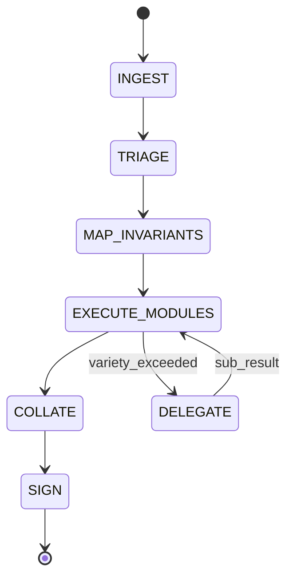

# Rust Standards

This skill is the **normative code-review and design-review protocol** for the APM2 Rust workspace.
It consolidates:

- **Review modules**: structured, fail-closed assessment logic (what to check, when to block).
- **Technical modules**: Rust semantics + security/safety contracts (what must be true in the code).

The intent is to eliminate “implicit reviewer intuition” by making requirements explicit, checkable, and evidence-backed.

## Scope

Applies to:

- All crates under the workspace `Cargo.toml`.
- Tooling / CI changes that affect Rust correctness, safety, or supply-chain posture.
- Changes that influence security- or determinism-sensitive behavior (see **SCP/DCP** below).

Non-goals:

- Stylistic preferences beyond what `rustfmt`/clippy enforce.
- “Nice-to-have” refactors that are not bound to a plan-of-record.

## Terminology

### ChangeSetBundle

A **ChangeSetBundle** is the minimum information needed to review a change *without guessing*:

- Identity: PR URL **or** `(base_sha, head_sha)`, author, title.
- Diff: changed paths and hunks.
- Workspace context: `Cargo.toml`, relevant crate manifests, feature flags.
- Evidence: CI results, logs, artifacts, and a binding plan-of-record.

### QCP

**QCP (Quality-Critical Path)** means the change touches surfaces where the cost of a subtle bug is disproportionate.

Implications:

- Proof burden escalates (tests + invariants + tool evidence).
- Severity threshold tightens (MAJOR findings frequently become presumptive FAIL).

### SCP

**SCP (Security-Critical Path)** is code that can:

- grant/deny authority (policy evaluation, capability checks, PCAC/AJC),
- sign/verify or canonicalize bytes used for signatures/hashes,
- handle secrets/credentials/keys,
- append/validate ledger state or evidence artifacts,
- cross trust boundaries (IPC/network ingress, FFI, sandboxing).

SCP is defined concretely by a **path map** (see `references/43_apm2_scp_dcp_map.md`).

### DCP

**DCP (Determinism-Critical Path)** is code whose output must be stable across:

- machines, architectures, and OSes,
- runs and restarts,
- feature/cfg permutations that are part of the support matrix.

Typical DCP surfaces: canonicalization, hashing inputs, signature payload assembly, ordering of ledger events.

## Taxonomy

Every normative rule line uses tagged headers:

- `[INVARIANT]`: always-true property required for soundness/correctness.
- `[HAZARD]`: known failure mode (UB, logic failure, security break, availability break).
- `[CONTRACT]`: explicit interface boundary requirement (public API, trait, FFI, protocol).
- `[PROVENANCE]`: citation anchor (Rust Reference/std docs, or APM2 spec/PRD/RFC).
- `[VERIFICATION]`: required tool evidence (tests, Miri, Loom, fuzzing, CI gates).

### Rule block format

- `[INVARIANT: INV-XXXX]` / `[HAZARD: RSK-XXXX]` / `[CONTRACT: CTR-XXXX]`
- `REJECT IF: ...` (merge-blocking unless explicitly waived)
- `ENFORCE BY: ...` (types, checks, tests, tooling)
- `[PROVENANCE] ...`
- `[VERIFICATION] ...`

Notes:

- “Risk levels” (LOW/MEDIUM/HIGH/CRITICAL) used in triage are **not** severities.
- Review severities are strictly: `BLOCKER | MAJOR | MINOR | NIT`.

---

## ChangeSet assessment loop



### State: INGEST

The ingest phase must collect enough context to avoid “review by inference”.

```yaml
inputs:
  # Identity can be PR-based or pure-git.
  - changeset_ref:
      one_of:
        - pr_url: string
        - base_sha: string
          head_sha: string

  - repo_root: FilePath
  - diff_chunks: DiffChunk[]
  - workspace_manifest: Cargo.toml
  - crate_manifests: Cargo.toml[]   # only crates touched by the diff
  - ci_evidence: CI_Evidence | null
  - plan_of_record: TicketRef | SpecRef | RFCRef | null

assertions:
  - ASSERT repo_root EXISTS
  - ASSERT diff_chunks.length > 0
  - ASSERT workspace_manifest.parse_ok == true

branching:
  IF assertions.any_fail:
    EMIT StopCondition(STOP-INGEST-INVALID, "Invalid ChangeSet metadata or missing workspace context")
    GOTO SIGN(BLOCKED)

exit_criteria:
  - changeset_bundle: ChangeSetBundle
```

### State: TRIAGE

```yaml
inputs:
  - changeset_bundle: ChangeSetBundle

operations:
  - INVOKE references/02_inputs_and_stop_conditions.md
  - INVOKE references/04_qcp_classification.md
  - INVOKE references/06_triage_fast_scan.md

outputs:
  - qcp: QCP_Result
  - risk_anchors: RiskAnchor[]
  - stop_conditions: StopCondition[]

branching:
  IF stop_conditions.any_triggered:
    GOTO SIGN(BLOCKED)

exit_criteria:
  - qcp.computed == true
  - risk_anchors.mapped == true
```

### State: MAP_INVARIANTS

```yaml
inputs:
  - changeset_bundle: ChangeSetBundle
  - risk_anchors: RiskAnchor[]
  - qcp: QCP_Result

operations:
  - INVOKE references/08_invariant_mapping.md

outputs:
  - invariant_map: InvariantMap

exit_criteria:
  - FOR EACH touched_type IN qcp.touched_types:
      invariant_map.has(touched_type) == true
```

### State: EXECUTE_MODULES

```yaml
inputs:
  - changeset_bundle: ChangeSetBundle
  - invariant_map: InvariantMap
  - qcp: QCP_Result

operations:
  - PARALLEL:
      - INVOKE references/10_abstraction_and_simplification.md
      - INVOKE references/12_rust_soundness_and_unsafe.md
      - INVOKE references/14_allocator_arena_pool_review.md
      - INVOKE references/16_error_handling_and_panic_policy.md
  - SEQUENTIAL:
      - INVOKE references/18_api_design_and_semver.md
      - INVOKE references/20_testing_evidence_and_ci.md
      - INVOKE references/22_performance_review.md
      - INVOKE references/24_dependency_and_build_surface.md

variety_check:
  IF context_tokens > MAX_TOKENS_PER_CHUNK:
    TRIGGER Sub_Holon_Delegation(chunk_subset)
    AWAIT sub_results
    MERGE sub_results INTO findings

outputs:
  - findings: Finding[]
```

### State: COLLATE

```yaml
inputs:
  - findings: Finding[]
  - qcp: QCP_Result

operations:
  - INVOKE references/26_severity_and_verdict.md

outputs:
  - evidence_bundle: EvidenceBundle
```

### State: SIGN

```yaml
inputs:
  - evidence_bundle: EvidenceBundle

branching:
  IF evidence_bundle.verdict == FAIL:
    EMIT FindingReport(verdict=FAIL)
  ELSE IF evidence_bundle.verdict == BLOCKED:
    EMIT FindingReport(verdict=BLOCKED)
  ELSE:
    EMIT MergeReceipt(verdict=PASS)

operations:
  - INVOKE references/28_required_actions_templates.md

outputs:
  - receipt: MergeReceipt | FindingReport
```

---

## Finding schema

```typescript
interface Finding {
  id: string;                 // e.g., "RUST-UNSAFE-001"
  location: Location;
  severity: Severity;         // "BLOCKER" | "MAJOR" | "MINOR" | "NIT"
  issue: string;              // one-paragraph description
  remediation: RemediationConstraint;
  metadata?: FindingMetadata;
}

interface Location {
  file_path: string;
  line: number;
  symbol?: string;
}

type Severity = "BLOCKER" | "MAJOR" | "MINOR" | "NIT";

interface RemediationConstraint {
  type: "CODE" | "TEST" | "DOC" | "CI";
  specification: string;
}

interface FindingMetadata {
  rationale?: string;         // "why" moved here
  references?: string[];      // pointers to rule IDs / specs / RFCs
  holonic_constraint?: HolonicViolation;
}

type HolonicViolation =
  | "BOUNDARY_INTEGRITY"       // nondeterminism introduced into DCP/SCP
  | "VARIETY_EXCEEDED"         // complexity overflow
  | "SECLUSION_BREACH";        // invariants leak to callers
```

---

## Holonic constraint checks

These checks are **cross-cutting** and can be emitted by any module.

```yaml
holonic_checks:
  boundary_integrity:
    # "nondeterminism" is only a defect when it contaminates DCP/SCP surfaces.
    # Example: using Instant for a network timeout is fine; using time to derive
    # canonical bytes or ledger ordering is not.
    trigger_patterns:
      - source: std::time::SystemTime
        when: "used in DCP/SCP code paths"
      - source: std::time::Instant
        when: "used to derive persisted/canonical bytes or ordering"
      - source: rand::
        when: "used without explicit seeding OR used in DCP outputs"
      - source: std::env::
        when: "used outside explicit boundary/config modules"
      - source: std::fs::
        when: "used in core/pure logic modules rather than boundary adapters"
    on_match:
      EMIT Finding(HOLONIC-BOUNDARY-001)

  variety_check:
    threshold: MAX_TOKENS_PER_CHUNK
    on_exceeded:
      TRIGGER Sub_Holon_Delegation

  seclusion_check:
    # Seclusion breach = forcing callers to uphold hidden invariants.
    trigger_patterns:
      - "pub fields that expose internal representation invariants"
      - "pub APIs that return/accept loosely typed identifiers where validation is required"
      - "pub generic bounds that leak implementation details (e.g., concrete error types, internal traits)"
    on_match:
      EMIT Finding(HOLONIC-SECLUSION-001)
```

---

## Logic module index

| Module | File | Domain |
|--------|------|--------|
| R00 | [00_operating_mode.md](references/00_operating_mode.md) | Audit posture |
| T00 | [01_contract_and_truth.md](references/01_contract_and_truth.md) | Language foundation |
| R01 | [02_inputs_and_stop_conditions.md](references/02_inputs_and_stop_conditions.md) | Input validation |
| T01 | [03_compilation_pipeline.md](references/03_compilation_pipeline.md) | Compilation pipeline |
| R02 | [04_qcp_classification.md](references/04_qcp_classification.md) | QCP scoring |
| T02 | [05_toolchain_cargo_build.md](references/05_toolchain_cargo_build.md) | Toolchain |
| R03 | [06_triage_fast_scan.md](references/06_triage_fast_scan.md) | Risk detection |
| T03 | [07_core_language_semantics.md](references/07_core_language_semantics.md) | Semantics |
| R04 | [08_invariant_mapping.md](references/08_invariant_mapping.md) | Invariant extraction |
| T04 | [09_ownership_borrowing_model.md](references/09_ownership_borrowing_model.md) | Ownership |
| R05 | [10_abstraction_and_simplification.md](references/10_abstraction_and_simplification.md) | Design quality |
| T05 | [11_lifetimes_variance_hrtb.md](references/11_lifetimes_variance_hrtb.md) | Lifetimes |
| R06 | [12_rust_soundness_and_unsafe.md](references/12_rust_soundness_and_unsafe.md) | Memory safety |
| T06 | [13_traits_generics_coherence.md](references/13_traits_generics_coherence.md) | Traits |
| R07 | [14_allocator_arena_pool_review.md](references/14_allocator_arena_pool_review.md) | Allocator audit |
| T07 | [15_errors_panics_diagnostics.md](references/15_errors_panics_diagnostics.md) | Diagnostics |
| R08 | [16_error_handling_and_panic_policy.md](references/16_error_handling_and_panic_policy.md) | Failure semantics |
| T08 | [17_layout_repr_drop.md](references/17_layout_repr_drop.md) | Layout |
| R09 | [18_api_design_and_semver.md](references/18_api_design_and_semver.md) | API + semver |
| T09 | [19_unsafe_rust_obligations.md](references/19_unsafe_rust_obligations.md) | Unsafe obligations |
| R10 | [20_testing_evidence_and_ci.md](references/20_testing_evidence_and_ci.md) | Test + CI |
| T10 | [21_concurrency_atomics_memory_order.md](references/21_concurrency_atomics_memory_order.md) | Concurrency |
| R11 | [22_performance_review.md](references/22_performance_review.md) | Performance |
| T11 | [23_async_pin_cancellation.md](references/23_async_pin_cancellation.md) | Async |
| R12 | [24_dependency_and_build_surface.md](references/24_dependency_and_build_surface.md) | Supply chain |
| T12 | [25_api_design_stdlib_quality.md](references/25_api_design_stdlib_quality.md) | API quality |
| R13 | [26_severity_and_verdict.md](references/26_severity_and_verdict.md) | Verdict reducer |
| T13 | [27_collections_allocation_models.md](references/27_collections_allocation_models.md) | Collections |
| R14 | [28_required_actions_templates.md](references/28_required_actions_templates.md) | Output actions |
| T14 | [29_unicode_text_graphemes.md](references/29_unicode_text_graphemes.md) | Unicode |
| T15 | [30_paths_filesystem_os.md](references/30_paths_filesystem_os.md) | Filesystem |
| T16 | [31_io_protocol_boundaries.md](references/31_io_protocol_boundaries.md) | I/O |
| T17 | [32_testing_fuzz_miri_evidence.md](references/32_testing_fuzz_miri_evidence.md) | Verification |
| T18 | [33_performance_measurement.md](references/33_performance_measurement.md) | Measurement |
| T19 | [34_security_adjacent_rust.md](references/34_security_adjacent_rust.md) | Security |
| T20 | [35_cfg_features_build_matrix.md](references/35_cfg_features_build_matrix.md) | Build matrix |
| T21 | [36_msrv_editions_maintenance.md](references/36_msrv_editions_maintenance.md) | Maintenance |
| T22 | [37_macros_buildscripts_proc_macros.md](references/37_macros_buildscripts_proc_macros.md) | Metaprogramming |
| T23 | [38_ffi_and_abi.md](references/38_ffi_and_abi.md) | FFI |
| T24 | [39_hazard_catalog_checklists.md](references/39_hazard_catalog_checklists.md) | Hazard catalog |
| T25 | [40_time_monotonicity_determinism.md](references/40_time_monotonicity_determinism.md) | Time |
| T26 | [41_apm2_safe_patterns_and_anti_patterns.md](references/41_apm2_safe_patterns_and_anti_patterns.md) | APM2 patterns |
| T27 | [42_distributed_security_invariants.md](references/42_distributed_security_invariants.md) | Distributed security |
| T28 | [42_pcac_ajc_integration.md](references/42_pcac_ajc_integration.md) | PCAC/AJC integration |
| T29 | [43_apm2_scp_dcp_map.md](references/43_apm2_scp_dcp_map.md) | SCP/DCP map |

---

## Resource budgets

```yaml
operational_envelopes:
  MAX_TOKENS_PER_CHUNK: 8000
  MAX_RETRIES_PER_GATE: 2
  MAX_SUBHOLON_DEPTH: 3
  TIMEOUT_PER_MODULE_MS: 30000
```
