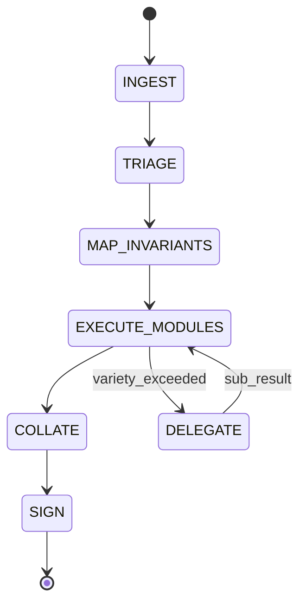

# Rust Standards: Unified Protocol & Specification

This skill provides a consolidated source of truth for Rust development, combining the assessment protocols of `review-rust` and the technical specifications of `rust-textbook`.

## Taxonomy (from rust-textbook)

Every rule in the technical specification uses tagged lines:

- `[INVARIANT]`: always-true property required for soundness/correctness.
- `[HAZARD]`: compiler/hardware/runtime behavior that causes UB or logic failures.
- `[CONTRACT]`: interface boundary requirement (public API, trait boundary, FFI).
- `[PROVENANCE]`: normative citation requirement (Rust Reference/std docs section anchor).
- `[VERIFICATION]`: mandated tool evidence (Miri, Kani, Loom, Proptest).

### Rule Block Format
- `[INVARIANT: INV-XXXX]` / `[HAZARD: RSK-XXXX]` / `[CONTRACT: CTR-XXXX]`
- `REJECT IF: ...` (non-negotiable rejection conditions)
- `ENFORCE BY: ...` (types, patterns, wrappers)
- `[PROVENANCE] ...`
- `[VERIFICATION] ...`

---

## ChangeSet Assessment Loop



### State: INGEST

```yaml
inputs:
  - pr_url: string
  - head_sha: string
  - diff_chunks: DiffChunk[]
  - crate_manifest: Cargo.toml
  - ci_logs: CI_Log_JSON
  - plan_of_record: TicketRef | null

assertions:
  - ASSERT pr_url IS_VALID_URL
  - ASSERT head_sha MATCHES /^[a-f0-9]{40}$/
  - ASSERT diff_chunks.length > 0

branching:
  IF assertions.any_fail:
    EMIT Finding(INGEST-001, "Invalid ChangeSet metadata")
    GOTO SIGN(FAILED)

exit_criteria:
  - changeset_bundle: ChangeSetBundle
```

### State: TRIAGE

```yaml
inputs:
  - changeset_bundle: ChangeSetBundle

operations:
  - INVOKE references/02_inputs_and_stop_conditions.md
  - INVOKE references/04_qcp_classification.md
  - INVOKE references/06_triage_fast_scan.md

outputs:
  - qcp_score: QCP_Result
  - risk_anchors: RiskAnchor[]
  - stop_conditions: StopCondition[]

branching:
  IF stop_conditions.any_triggered:
    EMIT Finding(TRIAGE-STOP, stop_conditions)
    GOTO SIGN(BLOCKED)

exit_criteria:
  - qcp_score.computed == true
  - risk_anchors.mapped == true
```

### State: MAP_INVARIANTS

```yaml
inputs:
  - changeset_bundle: ChangeSetBundle
  - risk_anchors: RiskAnchor[]

operations:
  - INVOKE references/08_invariant_mapping.md

outputs:
  - invariant_map: InvariantMap

schema InvariantMap:
  entries: Map<TypeSymbol, InvariantEntry>

schema InvariantEntry:
  type_path: string
  invariants:
    - category: REPR | OWNERSHIP | TEMPORAL | FAILURE | CONCURRENCY | PORTABILITY
      predicate: string
      proof_method: TYPE_SYSTEM | TEST | COMMENT | MIRI | LOOM
      proof_location: FilePath:Line | null

exit_criteria:
  - FOR EACH touched_type IN qcp_types:
      invariant_map.has(touched_type) == true
```

### State: EXECUTE_MODULES

```yaml
inputs:
  - changeset_bundle: ChangeSetBundle
  - invariant_map: InvariantMap
  - qcp_score: QCP_Result

operations:
  - PARALLEL:
      - INVOKE references/10_abstraction_and_simplification.md
      - INVOKE references/12_rust_soundness_and_unsafe.md
      - INVOKE references/14_allocator_arena_pool_review.md
      - INVOKE references/16_error_handling_and_panic_policy.md
  - SEQUENTIAL:
      - INVOKE references/18_api_design_and_semver.md
      - INVOKE references/20_testing_evidence_and_ci.md
      - INVOKE references/22_performance_review.md
      - INVOKE references/24_dependency_and_build_surface.md

variety_check:
  IF context_tokens > MAX_TOKENS_PER_CHUNK:
    TRIGGER Sub_Holon_Delegation(chunk_subset)
    AWAIT sub_results
    MERGE sub_results INTO findings

outputs:
  - findings: Finding[]
```

### State: COLLATE

```yaml
inputs:
  - findings: Finding[]

operations:
  - INVOKE references/26_severity_and_verdict.md

outputs:
  - evidence_bundle: EvidenceBundle

schema EvidenceBundle:
  findings: Finding[]
  blocker_count: int
  major_count: int
  minor_count: int
  nit_count: int
  verdict: PASS | FAIL | BLOCKED
```

### State: SIGN

```yaml
inputs:
  - evidence_bundle: EvidenceBundle

branching:
  IF evidence_bundle.blocker_count > 0:
    EMIT FindingReport(verdict=FAIL)
  ELSE IF evidence_bundle.blocked:
    EMIT FindingReport(verdict=BLOCKED)
  ELSE:
    EMIT MergeReceipt(verdict=PASS)

operations:
  - INVOKE references/28_required_actions_templates.md

outputs:
  - receipt: MergeReceipt | FindingReport
```

---

## Finding Schema

```typescript
interface Finding {
  id: FindingID;          // e.g., "RUST-UNSAFE-001"
  location: Location;
  severity: Severity;
  remediation: RemediationConstraint;
  metadata?: FindingMetadata;
}

interface Location {
  file_path: string;
  line: number;
  symbol?: string;
}

type Severity = "BLOCKER" | "MAJOR" | "MINOR" | "NIT";

interface RemediationConstraint {
  type: "CODE" | "TEST" | "DOC" | "CI";
  specification: string;
}

interface FindingMetadata {
  rationale?: string;      // "why" moved here
  references?: string[];
  holonic_constraint?: HolonicViolation;
}

type HolonicViolation =
  | "BOUNDARY_INTEGRITY"   // nondeterminism introduced
  | "VARIETY_EXCEEDED"     // complexity overflow
  | "SECLUSION_BREACH";    // implementation leak
```

---

## Holonic Constraint Checks

Integrated into all Logic Modules:

```yaml
holonic_checks:
  boundary_integrity:
    trigger_patterns:
      - std::time::SystemTime
      - std::time::Instant (in non-test code)
      - rand:: (without deterministic seed)
      - std::env::var
      - std::fs:: (in core logic)
    on_match:
      EMIT Finding(HOLONIC-BOUNDARY-001)

  variety_check:
    threshold: MAX_TOKENS_PER_CHUNK
    on_exceeded:
      TRIGGER Sub_Holon_Delegation

  seclusion_check:
    trigger_patterns:
      - pub field exposing internal repr
      - pub fn returning private type
      - impl detail in pub trait bounds
    on_match:
      EMIT Finding(HOLONIC-SECLUSION-001)
```

---

## Logic Module Index

| Module | File | Domain |
|--------|------|--------|
| R00 | [00_operating_mode.md](references/00_operating_mode.md) | Audit posture |
| T00 | [01_contract_and_truth.md](references/01_contract_and_truth.md) | Language Foundation |
| R01 | [02_inputs_and_stop_conditions.md](references/02_inputs_and_stop_conditions.md) | Input validation |
| T01 | [03_compilation_pipeline.md](references/03_compilation_pipeline.md) | Pipeline |
| R02 | [04_qcp_classification.md](references/04_qcp_classification.md) | QCP scoring |
| T02 | [05_toolchain_cargo_build.md](references/05_toolchain_cargo_build.md) | Toolchain |
| R03 | [06_triage_fast_scan.md](references/06_triage_fast_scan.md) | Risk detection |
| T03 | [07_core_language_semantics.md](references/07_core_language_semantics.md) | Semantics |
| R04 | [08_invariant_mapping.md](references/08_invariant_mapping.md) | Invariant extraction |
| T04 | [09_ownership_borrowing_model.md](references/09_ownership_borrowing_model.md) | Ownership |
| R05 | [10_abstraction_and_simplification.md](references/10_abstraction_and_simplification.md) | Design quality |
| T05 | [11_lifetimes_variance_hrtb.md](references/11_lifetimes_variance_hrtb.md) | Lifetimes |
| R06 | [12_rust_soundness_and_unsafe.md](references/12_rust_soundness_and_unsafe.md) | Memory safety |
| T06 | [13_traits_generics_coherence.md](references/13_traits_generics_coherence.md) | Traits |
| R07 | [14_allocator_arena_pool_review.md](references/14_allocator_arena_pool_review.md) | Allocator audit |
| T07 | [15_errors_panics_diagnostics.md](references/15_errors_panics_diagnostics.md) | Diagnostics |
| R08 | [16_error_handling_and_panic_policy.md](references/16_error_handling_and_panic_policy.md) | Failure semantics |
| T08 | [17_layout_repr_drop.md](references/17_layout_repr_drop.md) | Layout |
| R09 | [18_api_design_and_semver.md](references/18_api_design_and_semver.md) | API + MSRV |
| T09 | [19_unsafe_rust_obligations.md](references/19_unsafe_rust_obligations.md) | Unsafe |
| R10 | [20_testing_evidence_and_ci.md](references/20_testing_evidence_and_ci.md) | Test + CI |
| T10 | [21_concurrency_atomics_memory_order.md](references/21_concurrency_atomics_memory_order.md) | Concurrency |
| R11 | [22_performance_review.md](references/22_performance_review.md) | Performance |
| T11 | [23_async_pin_cancellation.md](references/23_async_pin_cancellation.md) | Async |
| R12 | [24_dependency_and_build_surface.md](references/24_dependency_and_build_surface.md) | Supply chain |
| T12 | [25_api_design_stdlib_quality.md](references/25_api_design_stdlib_quality.md) | API Quality |
| R13 | [26_severity_and_verdict.md](references/26_severity_and_verdict.md) | Verdict reducer |
| T13 | [27_collections_allocation_models.md](references/27_collections_allocation_models.md) | Collections |
| R14 | [28_required_actions_templates.md](references/28_required_actions_templates.md) | Output actions |
| T14 | [29_unicode_text_graphemes.md](references/29_unicode_text_graphemes.md) | Unicode |
| T15 | [30_paths_filesystem_os.md](references/30_paths_filesystem_os.md) | Filesystem |
| T16 | [31_io_protocol_boundaries.md](references/31_io_protocol_boundaries.md) | I/O |
| T17 | [32_testing_fuzz_miri_evidence.md](references/32_testing_fuzz_miri_evidence.md) | Verification |
| T18 | [33_performance_measurement.md](references/33_performance_measurement.md) | Performance |
| T19 | [34_security_adjacent_rust.md](references/34_security_adjacent_rust.md) | Security |
| T20 | [35_cfg_features_build_matrix.md](references/35_cfg_features_build_matrix.md) | Build Matrix |
| T21 | [36_msrv_editions_maintenance.md](references/36_msrv_editions_maintenance.md) | Maintenance |
| T22 | [37_macros_buildscripts_proc_macros.md](references/37_macros_buildscripts_proc_macros.md) | Metaprogramming |
| T23 | [38_ffi_and_abi.md](references/38_ffi_and_abi.md) | FFI |
| T24 | [39_hazard_catalog_checklists.md](references/39_hazard_catalog_checklists.md) | Hazards |
| T25 | [40_time_monotonicity_determinism.md](references/40_time_monotonicity_determinism.md) | Time |
| T26 | [41_apm2_safe_patterns_and_anti_patterns.md](references/41_apm2_safe_patterns_and_anti_patterns.md) | APM2 Patterns |

---

## Resource Budgets

```yaml
operational_envelopes:
  MAX_TOKENS_PER_CHUNK: 8000
  MAX_RETRIES_PER_GATE: 2
  MAX_SUBHOLON_DEPTH: 3
  TIMEOUT_PER_MODULE_MS: 30000
```
