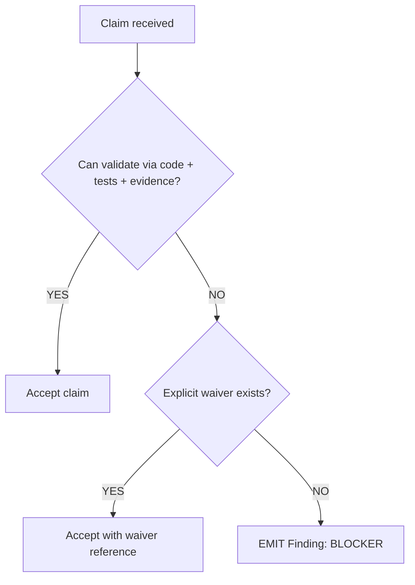

# M00: Operating Mode (Truth, Trust Boundaries, Execution)

```yaml
module_id: M00
domain: audit_posture
inputs: [ChangeSetBundle, ReviewerContext]
outputs: [AuditConfig]
```

---

## Configuration state

This module exists to make the review posture explicit and non-negotiable.

```yaml
audit_config:
  truth_model:
    implementer_commentary: NON_BINDING
    truth_sources_in_priority_order:
      - diff_content
      - surrounding_code_and_callers
      - binding_requirements          # PRD/RFC/spec/ticket + acceptance criteria
      - ci_evidence_and_artifacts     # logs, reports, coverage, provenance

  execution_model:
    # Default posture is "read-only": do not execute untrusted code.
    default_mode: STATIC_ONLY

    modes:
      STATIC_ONLY:
        description: "No compilation, no tests, no macro/build-script execution."
        allowed_actions:
          - file_read
          - static_inspection
          - text_search
          - manifest_review (Cargo.toml / deny.toml / rust-toolchain.toml)
          - CI_log_review

      SANDBOXED_EXECUTION:
        description: "Execution is permitted only under an explicit sandbox contract."
        preconditions:
          - hermetic: true              # no host-global state dependencies
          - ephemeral: true             # disposable workspace
          - secretless: true            # no ambient tokens/SSH keys in env/fs
          - network_restricted: true    # ideally no egress; never reaches prod services
          - provenance_logged: true     # commands + hashes captured for audit
        authority: SUPPLEMENTARY        # CI remains authoritative; local runs only support diagnosis
        preferred_entrypoint:
          - "./scripts/ci/run_local_ci_orchestrator.sh"
        forbidden:
          - "ad-hoc curl | sh installers"
          - "executing PR code in pull_request_target context with privileged tokens"

  waiver_model:
    # Waivers exist, but they are explicit, scoped, and auditable.
    requirements:
      - waiver_must_reference: RFC | ticket | security_exception_record
      - waiver_must_be_scoped_to: (file_path, symbol, hazard_id)
      - waiver_must_have_expiry_or_followup: true
```

---

## Decision rules



Clarifications:

- “Can validate” means a reviewer can point to an enforcement mechanism (types/checks/tests/tools),
  not “the author seems confident”.
- “Waiver exists” means a durable artifact exists (ticket/RFC/security exception), not a PR comment.

---

## Re-audit protocol

```yaml
re_audit:
  trigger:
    condition: "QCP == YES AND remediation_applied == true"

  procedure:
    - focus: [remediation_correctness, regression_risk, evidence_update]
    - scope: changed_files_since_last_review
    - inherit: previous_finding_ids
    - confirm: "new CI evidence covers the remediation"

  output:
    type: ReAuditResult
    fields:
      - findings_resolved: FindingID[]
      - findings_new: Finding[]
      - findings_regressed: FindingID[]
```

---

## Assertions

```yaml
assertions:
  - id: M00-001
    predicate: "reviewer.trust_model == INDEPENDENT"
    on_fail: null  # configuration, not a finding

  - id: M00-002
    predicate: "execution_mode == STATIC_ONLY OR sandbox_contract.valid == true"
    on_fail: null  # configuration
```
