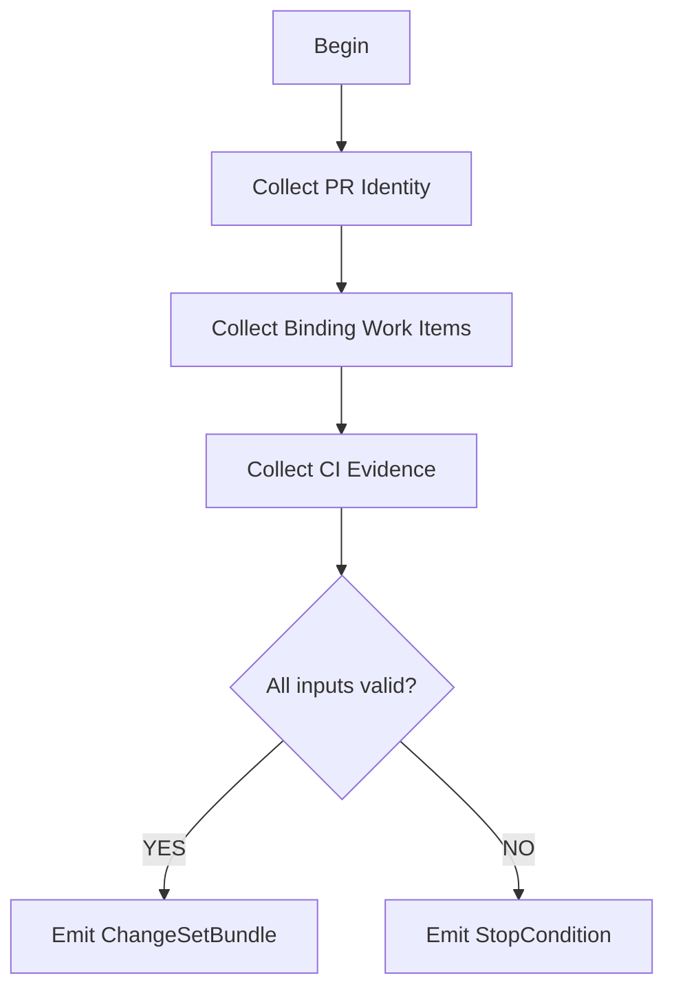

# M01: Inputs and Stop Conditions

```yaml
module_id: M01
domain: input_validation
inputs: [PR_URL, HEAD_SHA]
outputs: [ChangeSetBundle, StopCondition[]]
```

---

## Input Collection Protocol



---

## State: Collect PR Identity

```yaml
operation: gh_pr_view
command: |
  gh pr view $PR_URL --json title,number,author,baseRefName,headRefName,commits,files,additions,deletions

required_fields:
  - pr_url: string
  - pr_number: int
  - branch_name: string
  - merge_base: string
  - commit_set: CommitSHA[]

assertions:
  - id: INPUT-001
    predicate: "pr_url IS_VALID_URL"
    on_fail:
      EMIT Finding:
        id: INPUT-001
        severity: BLOCKER
        remediation:
          type: DOC
          specification: "Provide valid PR URL"
```

---

## State: Collect Binding Work Items

```yaml
required_fields:
  - ticket_ids: TicketRef[]
  - spec_files: FilePath[]
  - acceptance_criteria: Criterion[]
  - evidence_artifacts: ArtifactRef[]

assertions:
  - id: INPUT-002
    predicate: |
      IF diff.is_non_trivial THEN
        binding_requirements.length > 0
    on_fail:
      EMIT StopCondition:
        id: STOP-NO-BINDING
        severity: BLOCKER
        message: "Non-trivial changes require binding ticket/spec"
        remediation:
          type: DOC
          specification: "Link PR to ticket or spec with acceptance criteria"
```

---

## State: Collect CI Evidence

```yaml
sources:
  - ci_status_checks
  - ci_logs
  - ci_artifacts:
      - test_results
      - doc_builds
      - clippy_output
      - benchmark_results  # if required
      - fuzz_results       # if required
      - miri_results       # if required
      - loom_results       # if required

assertions:
  - id: INPUT-003
    predicate: |
      IF qcp_change_exists THEN
        ci_evidence.sufficient_for(qcp_change)
    on_fail:
      EMIT StopCondition:
        id: STOP-CI-INSUFFICIENT
        severity: BLOCKER
        message: "QCP change lacks sufficient CI evidence"
        remediation:
          type: CI
          specification: "Add CI coverage for QCP paths"

  - id: INPUT-004
    predicate: |
      IF evidence_claims.runtime_path THEN
        ci_evidence.executes_real_runtime_path AND
        NOT ci_evidence.simulated_runtime_path
    on_fail:
      EMIT StopCondition:
        id: STOP-EVIDENCE-SIMULATION
        severity: BLOCKER
        message: "Evidence claims runtime path but tests simulate it"
        remediation:
          type: TEST
          specification: "Exercise real runtime path or add explicit waiver"
```

---

## Output Schema

```typescript
interface ChangeSetBundle {
  pr_identity: PRIdentity;
  binding_requirements: BindingRequirement[];
  ci_evidence: CIEvidence;
  diff_chunks: DiffChunk[];
  crate_manifest: CargoToml;
}

interface StopCondition {
  id: string;
  severity: "BLOCKER";
  message: string;
  remediation: RemediationConstraint;
}
```

---

## Exit Criteria

```yaml
exit_criteria:
  success:
    - changeset_bundle.complete == true
    - stop_conditions.length == 0

  blocked:
    - stop_conditions.any(s => s.severity == "BLOCKER")
```
