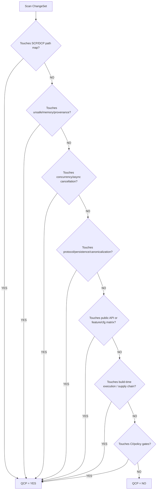

# M02: QCP classification (Escalation gate)

```yaml
module_id: M02
domain: risk_classification
inputs: [ChangeSetBundle]
outputs: [QCP_Result]
```

---

## Purpose

QCP is an **escalation decision**, not a moral judgement.

- False positives are acceptable (review is stricter).
- False negatives are not acceptable (review misses a high-impact failure mode).

QCP MUST be set to **YES** if any trigger matches.

---

## Decision procedure



---

## Trigger groups

### 1) SCP/DCP path map (APM2-specific)

Source of truth: `references/43_apm2_scp_dcp_map.md`.

```yaml
patterns:
  - changed_path_matches_scp: true
  - changed_path_matches_dcp: true
on_match:
  qcp: true
  categories: [SECURITY_CRITICAL_PATH, DETERMINISM_CRITICAL_PATH]
  justification: "Change touches SCP/DCP mapped code."
```

### 2) Soundness and memory correctness

```yaml
patterns:
  - regex: "\bunsafe\b"
  - regex: "\bunsafe\s+(fn|impl|trait)\b"
  - symbols: [NonNull, UnsafeCell, MaybeUninit, ManuallyDrop, Pin]
  - symbols: ["mem::transmute", "mem::zeroed", "mem::forget"]
  - keywords: [arena, pool, freelist, slab, allocator]
on_match:
  qcp: true
  categories: [SOUNDNESS_MEMORY]
```

### 3) Concurrency and cancellation

```yaml
patterns:
  - traits: [Send, Sync]
  - regex: "\bunsafe\s+impl\s+(Send|Sync)\b"
  - symbols: ["Atomic*", Ordering, fence]
  - symbols: ["tokio::select!", "futures::select!"]
  - keywords: ["lock-free", "lockfree", "epoch", "hazard pointer"]
on_match:
  qcp: true
  categories: [CONCURRENCY_ASYNC]
```

### 4) Protocol, persistence, canonicalization

```yaml
patterns:
  - path_contains: [protocol, codec, parser, frame, wire]
  - path_contains: [ledger, evidence, cas]
  - symbols: [append_verified, verify_signature, canonicalize]
  - serde_boundary: ["serde::Deserialize", "serde_json", "prost::Message"]
on_match:
  qcp: true
  categories: [PROTOCOL_PERSISTENCE]
```

### 5) Public API / cfg / feature matrix

```yaml
patterns:
  - public_item_changed: true        # pub fn/struct/trait/const/static
  - semver_relevant_change: true
  - feature_flag_changes: true
  - cfg_changes: true
on_match:
  qcp: true
  categories: [PUBLIC_API, BUILD_MATRIX]
```

### 6) Build-time execution and supply chain

```yaml
patterns:
  - modifies: [deny.toml, Cargo.toml, Cargo.lock, rust-toolchain.toml]
  - adds_or_modifies: [build.rs]
  - adds_or_modifies_proc_macro: true
  - adds_git_dependency: true
  - spawns_process: ["std::process::Command", "nix::unistd::exec*"]
on_match:
  qcp: true
  categories: [SUPPLY_CHAIN, BUILD_TIME_EXECUTION]
```

### 7) CI / policy gates

```yaml
patterns:
  - path_contains: [.github/workflows, scripts/ci]
  - modifies_lint_policy: true
  - modifies_security_guardrails: true
on_match:
  qcp: true
  categories: [GATE_POLICY]
```

---

## Output schema

```typescript
interface QCP_Result {
  qcp: boolean;
  categories: QCPCategory[];
  justification: string;          // short, human-readable rationale
  threshold_multiplier: number;   // 1.0 for NO, 2.0 for YES (conservative default)
  touched_paths: string[];        // normalized file paths (optional but recommended)
  touched_types?: string[];       // type symbols when available
}

type QCPCategory =
  | "SECURITY_CRITICAL_PATH"
  | "DETERMINISM_CRITICAL_PATH"
  | "SOUNDNESS_MEMORY"
  | "CONCURRENCY_ASYNC"
  | "PROTOCOL_PERSISTENCE"
  | "PUBLIC_API"
  | "BUILD_MATRIX"
  | "SUPPLY_CHAIN"
  | "BUILD_TIME_EXECUTION"
  | "GATE_POLICY";
```

---

## QCP implications

```yaml
if_qcp_yes:
  proof_burden: ELEVATED
  default_threshold_multiplier: 2.0
  evidence_expectations:
    - "CI must cover the changed paths under relevant feature sets"
    - "Unsafe/concurrency/protocol changes require tool-backed evidence (Miri/Loom/fuzz) where applicable"
  re_audit: "mandatory after fixes to QCP findings"

if_qcp_no:
  proof_burden: BASELINE
  default_threshold_multiplier: 1.0
```
