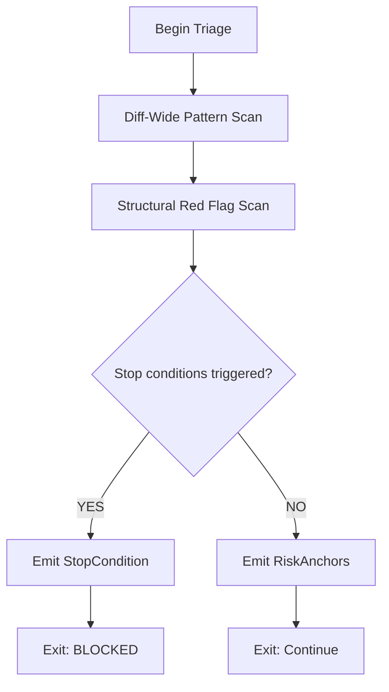

# M03: Triage Fast Scan

```yaml
module_id: M03
domain: risk_detection
inputs: [ChangeSetBundle]
outputs: [RiskAnchor[], StopCondition[]]
```

---

## Scan Protocol



---

## Pattern Scan: Risk Anchors

```yaml
scan_patterns:
  unsafe_memory:
    patterns:
      - "\\bunsafe\\b"
      - "\\bunsafe\\s+fn\\b"
      - "\\bunsafe\\s+impl\\b"
    risk_level: HIGH

  ffi_interop:
    patterns:
      - "\\bextern\\b"
      - "\\bffi\\b"
      - "#\\[repr\\(C\\)\\]"
      - "#\\[repr\\(packed\\)\\]"
    risk_level: HIGH

  dangerous_memory_ops:
    patterns:
      - "transmute"
      - "zeroed"
      - "MaybeUninit"
      - "ManuallyDrop"
      - "from_raw_parts"
      - "from_raw_parts_mut"
      - "set_len"
    risk_level: CRITICAL

  panic_vectors:
    patterns:
      - "\\.unwrap\\("
      - "\\.expect\\("
      - "panic!"
      - "todo!"
      - "unreachable!"
      - "dbg!"
    risk_level: MEDIUM

  concurrency_primitives:
    patterns:
      - "\\bSend\\b"
      - "\\bSync\\b"
      - "Atomic"
      - "Ordering::"
      - "\\bfence\\b"
    risk_level: HIGH

  global_state:
    patterns:
      - "static\\s+mut"
    risk_level: CRITICAL

  supply_chain:
    patterns:
      - "\\[dependencies\\]"
      - "\\[build-dependencies\\]"
      - "build\\.rs"
      - "proc-macro"
    risk_level: MEDIUM
```

---

## Structural Red Flags

```yaml
structural_checks:
  - id: STRUCT-001
    name: "Unrelated changes combined"
    predicate: |
      diff.subsystems.count > 3 AND
      diff.subsystems.coupling_score < 0.3
    severity: BLOCKER
    message: "Large PR combines unrelated changes"
    remediation:
      type: DOC
      specification: "Decompose into focused PRs"

  - id: STRUCT-002
    name: "Formatting churn mixed with logic"
    predicate: |
      diff.has_formatting_changes AND
      diff.has_logic_changes AND
      NOT diff.is_pure_formatting_pr
    severity: MAJOR
    message: "Formatting changes mixed with logic changes"
    remediation:
      type: DOC
      specification: "Separate formatting into dedicated PR"

  - id: STRUCT-003
    name: "Drive-by refactor"
    predicate: |
      diff.touches_foundational_code AND
      diff.refactors_unrelated_to_ticket AND
      binding_requirement.none_for_refactor
    severity: BLOCKER
    message: "Foundational refactor without binding ticket"
    remediation:
      type: DOC
      specification: "Create ticket for refactor scope"

  - id: STRUCT-004
    name: "Heavy suppression usage"
    predicate: |
      diff.added_allow_attributes.count > 2 OR
      diff.added_cfg_disable_patterns.count > 0
    severity: MAJOR
    message: "Excessive lint/test suppression"
    remediation:
      type: CODE
      specification: "Remove suppressions and fix underlying issues"

  - id: STRUCT-005
    name: "PR too large to review"
    predicate: |
      diff.lines_changed > 1000 OR
      diff.files_changed > 30
    severity: BLOCKER
    message: "PR exceeds reviewable size"
    remediation:
      type: DOC
      specification: "Decompose into smaller PRs (< 500 lines, < 15 files)"
```

---

## Output Schema

```typescript
interface RiskAnchor {
  category: string;
  pattern_matched: string;
  location: Location;
  risk_level: "CRITICAL" | "HIGH" | "MEDIUM" | "LOW";
  requires_deep_review: boolean;
}

interface TriageResult {
  risk_anchors: RiskAnchor[];
  stop_conditions: StopCondition[];
  proceed: boolean;
}
```

---

## Exit Criteria

```yaml
exit_criteria:
  proceed:
    - stop_conditions.filter(s => s.severity == "BLOCKER").length == 0

  blocked:
    - stop_conditions.any(s => s.severity == "BLOCKER")

outputs:
  - risk_anchors: "passed to invariant mapping"
  - stop_conditions: "escalated to SIGN state if blocking"
```

---

## Quick Reference: Diff Search Patterns

```yaml
quick_scan_checklist:
  unsafe_memory:
    - unsafe
    - MaybeUninit
    - ManuallyDrop
    - transmute
    - zeroed
    - set_len
    - from_raw_parts

  panics:
    - unwrap
    - expect
    - "panic!"
    - "todo!"
    - "unreachable!"

  concurrency:
    - "unsafe impl Send"
    - "unsafe impl Sync"
    - Atomic
    - "Ordering::Relaxed"
    - "static mut"

  policy_gates:
    - ".github/workflows"
    - "clippy.toml"
    - "[features]"
    - "[dependencies]"

  hard_coded:
    - "std::fs::"
    - "std::env::"
    - "println!"
    - "SystemTime"
    - "rand::"
```
