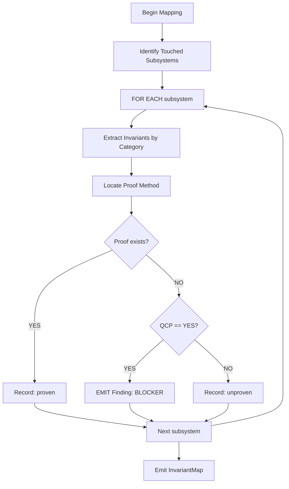

# M04: Invariant Mapping

```yaml
module_id: M04
domain: invariant_extraction
inputs: [ChangeSetBundle, RiskAnchor[]]
outputs: [InvariantMap]
```

---

## Mapping Protocol



---

## Invariant Categories

### Category 1: Representation Invariants

```yaml
category: REPR
extraction_patterns:
  - layout_assumptions: "repr(...)"
  - alignment_assumptions: "align(...)"
  - sentinel_values: "const.*SENTINEL|NULL|EMPTY"
  - size_boundaries: "const.*SIZE|CAPACITY|MAX|MIN"
  - pointer_provenance: "ptr::.*|NonNull"

required_fields:
  - type_path: string
  - predicate: string
  - proof_method: TYPE_SYSTEM | TEST | COMMENT | MIRI
  - proof_location: FilePath:Line | null
```

### Category 2: Ownership and Aliasing Invariants

```yaml
category: OWNERSHIP
extraction_patterns:
  - ownership_marker: "owned|borrow|ref|mut"
  - alias_prevention: "Cell|RefCell|UnsafeCell"
  - lifetime_binding: "'[a-z]+"

required_fields:
  - owner_type: string
  - alias_policy: NONE | SHARED | EXCLUSIVE
  - lifetime_scope: string
  - proof_method: TYPE_SYSTEM | TEST | MIRI
```

### Category 3: Temporal Invariants

```yaml
category: TEMPORAL
extraction_patterns:
  - drop_order: "Drop|drop|ManuallyDrop"
  - invalidation: "invalidate|stale|expired"
  - generation: "generation|version|epoch"

required_fields:
  - event: string  # when X happens
  - constraint: string  # Y must be true
  - proof_method: TEST | MIRI | LOOM
```

### Category 4: Failure Invariants

```yaml
category: FAILURE
extraction_patterns:
  - error_handling: "Result|Option|Error"
  - oom_handling: "try_|alloc|AllocError"
  - panic_safety: "catch_unwind|UnwindSafe"

required_fields:
  - failure_mode: string
  - behavior: PROPAGATE | RECOVER | ABORT
  - cleanup_guaranteed: boolean
  - proof_method: TEST | COMMENT
```

### Category 5: Concurrency Invariants

```yaml
category: CONCURRENCY
extraction_patterns:
  - thread_safety: "Send|Sync|Mutex|RwLock"
  - atomic_ordering: "Ordering::|fence"
  - lock_discipline: "lock|unlock|guard"

required_fields:
  - safety_claim: string
  - ordering_requirements: string[]
  - deadlock_freedom: boolean
  - proof_method: TEST | LOOM | COMMENT
```

### Category 6: Portability Invariants

```yaml
category: PORTABILITY
extraction_patterns:
  - pointer_width: "usize|isize|target_pointer_width"
  - endianness: "to_le|to_be|from_le|from_be"
  - alignment: "align_of|align_to"
  - platform_api: "cfg\\(target"

required_fields:
  - assumption: string
  - platforms_covered: string[]
  - fallback_behavior: string | null
  - proof_method: TEST | CI_MATRIX
```

---

## Proof Validation

```yaml
proof_methods:
  TYPE_SYSTEM:
    validation: "Invariant enforced by Rust type system"
    evidence: "Type signature demonstrates constraint"

  TEST:
    validation: "Test exists that exercises invariant boundary"
    evidence: "Test file:line that would fail if violated"

  COMMENT:
    validation: "SAFETY: or INVARIANT: comment documents reasoning"
    evidence: "Comment location adjacent to unsafe/critical code"

  MIRI:
    validation: "Miri CI job covers this code path"
    evidence: "CI job name + coverage confirmation"

  LOOM:
    validation: "Loom test explores concurrency state space"
    evidence: "Loom test file:line"

  CI_MATRIX:
    validation: "CI matrix covers target platforms"
    evidence: "CI job names for each platform"
```

---

## Stop Condition: Undocumented QCP Invariants

```yaml
assertion:
  id: INV-001
  predicate: |
    FOR EACH type IN qcp_touched_types:
      invariant_map.has(type) AND
      invariant_map.get(type).proof_method IS_NOT_NULL
  on_fail:
    EMIT Finding:
      id: INV-001
      severity: BLOCKER
      location: {type_definition}
      remediation:
        type: DOC
        specification: |
          Document invariants with SAFETY: or INVARIANT: comments
          AND add tests that defend the invariants
```

---

## Output Schema

```typescript
interface InvariantMap {
  entries: Map<TypeSymbol, InvariantEntry[]>;
  coverage: {
    total_types: number;
    proven_types: number;
    unproven_types: number;
  };
}

interface InvariantEntry {
  category: InvariantCategory;
  type_path: string;
  predicate: string;
  proof_method: ProofMethod | null;
  proof_location: Location | null;
  qcp_relevant: boolean;
}

type InvariantCategory =
  | "REPR"
  | "OWNERSHIP"
  | "TEMPORAL"
  | "FAILURE"
  | "CONCURRENCY"
  | "PORTABILITY";

type ProofMethod =
  | "TYPE_SYSTEM"
  | "TEST"
  | "COMMENT"
  | "MIRI"
  | "LOOM"
  | "CI_MATRIX";
```
