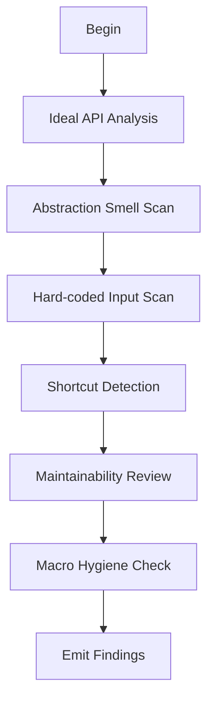

# M05: Abstraction and Simplification

```yaml
module_id: M05
domain: design_quality
inputs: [ChangeSetBundle, InvariantMap]
outputs: [Finding[]]
```

---

## Review Protocol



---

## State: Ideal API Analysis

```yaml
procedure:
  1. identify_cleanest_contract:
     - "What is the minimal public surface for requirements?"
  2. compare_to_pr:
     - delta: actual_api - ideal_api

assertions:
  - id: ABS-POLICY-001
    predicate: "NOT introduces_policy_where_mechanism_expected"
    on_fail:
      EMIT Finding:
        id: ABS-POLICY-001
        severity: MAJOR
        remediation:
          type: CODE
          specification: "Extract policy into configurable parameter"

  - id: ABS-LEAK-001
    predicate: "NOT leaks_internal_repr_to_public_api"
    on_fail:
      EMIT Finding:
        id: ABS-LEAK-001
        severity: MAJOR
        holonic_constraint: SECLUSION_BREACH
        remediation:
          type: CODE
          specification: "Hide internal representation behind opaque type"
```

---

## State: Abstraction Smell Detection

```yaml
smell_patterns:
  - id: SMELL-DUP
    pattern: "duplicated_logic_across_callsites"
    severity: MAJOR
    description: |
      Non-trivial functionality implemented in more than one location with
      substantively identical logic. Applies to: structured output emission,
      error formatting, state computation, file I/O patterns, CLI arg
      resolution, projection rendering, serialization protocols, validation
      logic, and any operation with behavioral semantics that could diverge.
      Copy-paste of non-trivial logic creates drift risk: one copy gets
      fixed or extended while others silently diverge. This is MAJOR, not
      a nit — behavioral divergence between copies is a latent defect.
    exclusions: |
      Trivial duplication is excluded: repeated one-liners, simple field
      access, boilerplate derives, or cases where extraction would create
      a helper with no reuse beyond the two sites and no behavioral
      semantics that could independently diverge.
    remediation: "Extract shared logic into helper function or module"

  - id: SMELL-FLAG
    pattern: "temporary_flags_unclear_lifecycle"
    severity: MAJOR
    remediation: "Document flag lifecycle or remove"

  - id: SMELL-ADHOC
    pattern: "special_case_for_single_caller"
    severity: MAJOR
    remediation: "Generalize or document exception"

  - id: SMELL-MIX
    pattern: "mixed_concerns"
    examples:
      - "allocation + logging"
      - "state_transition + io"
      - "parsing + policy"
    severity: MAJOR
    remediation: "Separate concerns into distinct modules"

  - id: SMELL-STRING
    pattern: "stringly_typed_contracts"
    severity: MAJOR
    remediation: "Replace with newtype or enum"

qcp_escalation:
  IF qcp == YES:
    severity_override: BLOCKER
```

---

## State: Hard-coded Input Detection

```yaml
red_flags:
  - id: HARD-PRINT
    pattern: "println!|eprintln! in library"
    severity: MAJOR
    remediation: "Inject writer or use tracing"

  - id: HARD-PATH
    pattern: "fixed filesystem path"
    severity: MAJOR
    remediation: "Accept path as parameter"

  - id: HARD-ENV
    pattern: "std::env::var in core logic"
    severity: MAJOR
    holonic_constraint: BOUNDARY_INTEGRITY
    remediation: "Inject configuration"

  - id: HARD-TIME
    pattern: "SystemTime|Instant without injection"
    severity: MAJOR
    holonic_constraint: BOUNDARY_INTEGRITY
    remediation: "Use clock trait for testability"

required_remediation_pattern:
  - "Isolate side effects behind interfaces"
  - "Keep core logic deterministic and testable"
```

---

## State: Shortcut Detection

```yaml
unacceptable_patterns:
  - id: SHORT-UNWRAP
    pattern: ".unwrap() on caller input"
    severity: BLOCKER
    remediation: "Return Result or Option"

  - id: SHORT-FALLBACK
    pattern: "silent fallback changing semantics"
    severity: MAJOR
    remediation: "Make fallback explicit or return error"

  - id: SHORT-TODO
    pattern: "todo!() in reachable state"
    severity: BLOCKER
    remediation: "Implement or return error"

  - id: SHORT-UNREACHABLE
    pattern: "unreachable!() in reachable state"
    severity: BLOCKER
    remediation: "Prove unreachability with test or fix logic"

  - id: SHORT-ALLOW
    pattern: "#[allow(clippy::...)] without justification"
    severity: MAJOR
    remediation: "Add justification comment or fix lint"

proof_requirements:
  IF shortcut_used:
    require:
      - "proof-by-construction explanation"
      - "test demonstrating boundary is unreachable"
```

---

## State: Maintainability Review

```yaml
local_reasoning_check:
  requirement: |
    Reader can understand function by reading:
    - signature
    - docs
    - function body
    - small number of helper types

  red_flags:
    - id: MAINT-GLOBAL
      pattern: "action at distance via globals"
      severity: MAJOR

    - id: MAINT-MACRO
      pattern: "macro indirection obscures invariants"
      severity: MAJOR

    - id: MAINT-MAGIC
      pattern: "magic constants without names"
      severity: MINOR

simplification_requirements:
  prefer:
    - "small pure helpers"
    - "types encoding invariants"
    - "explicit state machines over boolean soup"

  block_if_qcp:
    - "repeated code with slight divergence"
    - "deeply nested conditionals"
    - "parameter explosion"

naming_requirements:
  require:
    - "names reflecting invariants: NonZero, Aligned, Validated, Guard, Handle"
    - "comments explaining 'why' not 'what'"
    - "module-level docs for non-trivial components"

  avoid:
    - "misleading names promising stronger guarantees"
    - "TODO placeholders in production paths"
```

---

## State: Macro Hygiene Check

### `macro_rules!` Assertions

```yaml
macro_rules_checks:
  - id: MACRO-CRATE
    predicate: "uses $crate:: for internal references"
    on_fail:
      severity: MAJOR
      remediation: "Use $crate:: paths for hygiene"

  - id: MACRO-EXPORT
    predicate: "#[macro_export] only when required"
    on_fail:
      severity: MINOR
      remediation: "Remove unnecessary macro_export"

  - id: MACRO-SIDE
    predicate: "no hidden side effects"
    on_fail:
      severity: MAJOR
      remediation: "Document or eliminate side effects"

  - id: MACRO-CAPTURE
    predicate: "no identifier capture / action at distance"
    on_fail:
      severity: MAJOR
      remediation: "Use explicit parameters"
```

### Proc-Macro Assertions

```yaml
proc_macro_checks:
  auto_qcp: true

  - id: PROC-DETERM
    predicate: "no network, no filesystem unless documented"
    on_fail:
      severity: BLOCKER
      holonic_constraint: BOUNDARY_INTEGRITY
      remediation: "Remove non-deterministic operations"

  - id: PROC-DEPS
    predicate: "minimal dependency tree"
    on_fail:
      severity: MAJOR
      remediation: "Reduce proc-macro dependencies"

  - id: PROC-TEST
    predicate: "expansion tests exist"
    on_fail:
      severity: BLOCKER
      remediation: "Add snapshot or UI tests for expansions"

  - id: PROC-DOC
    predicate: "generated code documented"
    on_fail:
      severity: MAJOR
      remediation: "Document generated code guarantees"
```

---

## Anti-Bureaucracy Rule

```yaml
on_recurring_defect:
  DO_NOT: "propose more review"

  INSTEAD_PROPOSE:
    - "stricter invariants encoded in types"
    - "deterministic tests (negative, property, model-based)"
    - "clearer abstraction boundaries"
    - "simpler APIs reducing misuse space"
```

---

## Output Schema

```typescript
interface AbstractionFinding extends Finding {
  smell_category?: SmellCategory;
  holonic_constraint?: HolonicViolation;
}

type SmellCategory =
  | "DUPLICATION"
  | "FLAG_SOUP"
  | "ADHOC_SPECIAL"
  | "MIXED_CONCERNS"
  | "STRINGLY_TYPED"
  | "HARD_CODED"
  | "SHORTCUT"
  | "MACRO_HYGIENE";
```
