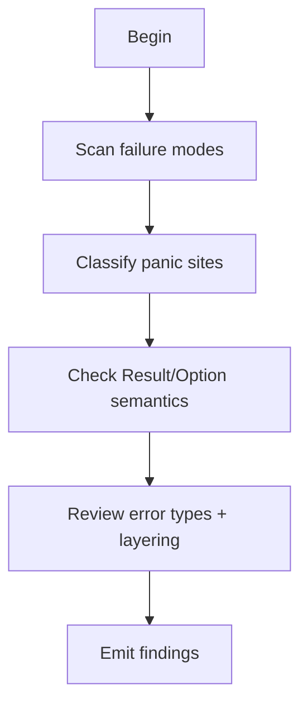

# M08: Error handling and panic policy

```yaml
module_id: M08
domain: failure_semantics
inputs: [ChangeSetBundle, InvariantMap, QCP_Result]
outputs: [Finding[]]
```

---

## Purpose

This module enforces a simple rule:

> **Panics are bugs, not control flow; errors are part of the contract.**

Special care is required in:
- SCP (DoS and invariant bypass risk),
- protocol/persistence boundaries (fail-open vs fail-closed),
- drop/unwind paths (panic-safety).

---

## Review protocol



---

## State: Failure mode scan

```yaml
assertions:
  - id: ERR-STRUCT
    predicate: "errors are structured and actionable (typed enum where callers need to branch)"
    on_fail:
      severity: MAJOR
      remediation: "Use a typed error enum and preserve sources."

  - id: ERR-BOUND
    predicate: "error boundaries are documented at module boundaries"
    on_fail:
      severity: MINOR
      remediation: "Document propagation and failure policy at the boundary."

discouraged_patterns:
  - pattern: "silent fallback that changes semantics (fail-open)"
    severity: MAJOR

  - pattern: "swallowing errors (log-only) on security or integrity failures"
    severity: BLOCKER
```

---

## State: Panic classification

Panics are permitted only when **unreachability is proven by construction** and the panic does not create a security availability hazard.

```yaml
panic_taxonomy:
  UNACCEPTABLE:
    conditions:
      - "derived from caller input (parsing, indexing, slicing, unwrap/expect on input path)"
      - "triggered by plausible internal state in production"
      - "occurs in SCP (availability/DoS risk) unless explicitly mitigated"
    on_match:
      EMIT Finding:
        id: PANIC-UNACCEPTABLE
        severity: BLOCKER
        remediation:
          type: CODE
          specification: "Replace panic/unwrap with structured Result; fail-closed where applicable."

  POTENTIALLY_ACCEPTABLE:
    conditions:
      - "internal invariant proven unreachable by type construction"
      - "debug assertion intended as diagnostics"
    requirements:
      - "public APIs document panics with an explicit '# Panics' section"
      - "tests demonstrate the invariant boundary (and that panics are not reachable via inputs)"

decision_tree:
  FOR EACH panic_site IN diff:
    CHECK:
      - id: PANIC-INPUT
        predicate: "NOT derived_from_caller_input"
        on_fail: BLOCKER

      - id: PANIC-PLAUSIBLE
        predicate: "NOT triggered_by_plausible_production_state"
        on_fail: BLOCKER

      - id: PANIC-SCP
        predicate: |
          IF panic_site.in_path_map(SCP) THEN
            has_explicit_dos_mitigation_or_waiver
        on_fail: BLOCKER

      - id: PANIC-DOC
        predicate: |
          IF public_function AND panic_possible THEN
            has_panics_doc_section
        on_fail:
          severity: MAJOR
          remediation: "Add '# Panics' documentation stating the preconditions."

      - id: PANIC-TEST
        predicate: |
          IF panic_is_claimed_unreachable THEN
            test_exists_demonstrating_boundary
        on_fail:
          severity: MAJOR
          remediation: "Add a test demonstrating the panic boundary is unreachable under correct use."
```

Note: APM2 release builds use `panic = abort` for binaries (see workspace profiles). This makes “panic as error handling”
even less acceptable: abort is a hard availability failure.

---

## State: Result/Option semantics

```yaml
semantic_requirements:
  Option:
    use_case: "absence is expected and non-exceptional"
    anti_pattern: "hiding errors as None"

  Result:
    use_case: "fallibility with diagnostics"
    anti_pattern: "converting errors to default values on failure"

  panic:
    use_case: "bug conditions only, not user error"
    anti_pattern: "using panic for recoverable conditions"

assertions:
  - id: SEM-OPTION
    predicate: |
      IF returns Option AND caller_needs_diagnostics THEN
        VIOLATION
    on_fail:
      EMIT Finding:
        id: ERR-OPTION-001
        severity: MAJOR
        remediation:
          type: CODE
          specification: "Return Result with a typed error."

  - id: SEM-ERASE
    predicate: "NOT converts_error_to_none_or_default"
    on_fail:
      EMIT Finding:
        id: ERR-ERASE-001
        severity: MAJOR
        remediation:
          type: CODE
          specification: "Preserve and propagate error information; avoid fail-open defaults."
```

---

## State: Error type review (layering + leakage)

```yaml
custom_error_criteria:
  prefer_typed_errors_when:
    - "errors are part of a library API contract"
    - "callers need to match on variants"
    - "security/policy code needs precise denial reasons (without leaking secrets)"

assertions:
  - id: TYPE-CONTEXT
    predicate: "error type preserves context (source errors, causal chain)"
    on_fail:
      severity: MAJOR
      remediation: "Include source error or context (e.g., `#[source]`)."

  - id: TYPE-STRING
    predicate: "NOT relies_on_string_comparison_for_control_flow"
    on_fail:
      severity: MAJOR
      remediation: "Use enum variants, not string matching."

  - id: TYPE-LEAK
    predicate: "errors and logs do not include secrets/keys/tokens"
    on_fail:
      severity: BLOCKER
      remediation: "Redact or wrap secrets (see secrets policy in `documents/security`)."

anti_patterns:
  - id: TYPE-ANYHOW-LIB
    pattern: "anyhow in a library/public API boundary"
    severity: MAJOR
    remediation: "Use typed errors for library boundaries; reserve anyhow for binaries and top-level orchestration."

  - id: TYPE-UNWRAP
    pattern: ".unwrap()/.expect() on recoverable errors"
    severity: MAJOR
    remediation: "Propagate a Result; unwrap is acceptable only under proven unreachability (documented) or in tests."
```

---

## Output schema

```typescript
interface ErrorHandlingFinding extends Finding {
  panic_classification?: PanicClass;
  semantic_violation?: SemanticViolation;
}

type PanicClass =
  | "CALLER_INPUT"
  | "PLAUSIBLE_STATE"
  | "SCP_DOS_RISK"
  | "ACCEPTABLE_INVARIANT"
  | "DEBUG_ONLY";

type SemanticViolation =
  | "OPTION_HIDING_ERROR"
  | "RESULT_TO_DEFAULT"
  | "PANIC_AS_CONTROL_FLOW"
  | "CONTEXT_ERASURE"
  | "STRING_COMPARISON";
```
