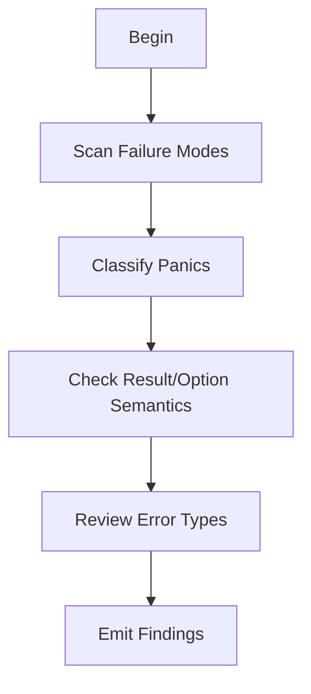

# M08: Error Handling and Panic Policy

```yaml
module_id: M08
domain: failure_semantics
inputs: [ChangeSetBundle, InvariantMap]
outputs: [Finding[]]
```

---

## Review Protocol



---

## State: Failure Mode Scan

```yaml
assertions:
  - id: ERR-STRUCT
    predicate: "errors are structured and actionable"
    on_fail:
      severity: MAJOR
      remediation: "Use typed error enum"

  - id: ERR-BOUND
    predicate: "error boundaries documented"
    on_fail:
      severity: MINOR
      remediation: "Document error propagation paths"

discouraged_patterns:
  - pattern: "panic in normal execution"
    severity: MAJOR

  - pattern: "silent fallback changing semantics"
    severity: MAJOR
```

---

## State: Panic Classification

```yaml
panic_taxonomy:
  UNACCEPTABLE:
    conditions:
      - "derived from caller input (parsing, indexing)"
      - "triggered by plausible internal state in production"
      - "occurs in Security-Critical Path (SCP) code (DoS risk)"
    on_match:
      EMIT Finding:
        id: PANIC-UNACCEPTABLE
        severity: BLOCKER
        remediation:
          type: CODE
          specification: "Replace with structured Result error and fail-closed handling"

  POTENTIALLY_ACCEPTABLE:
    conditions:
      - "internal invariant proven unreachable by type construction"
      - "debug assertion with minimal production impact"
    requirements:
      - "# Panics documentation for public functions"
      - "tests demonstrating boundary unreachable under correct use"

decision_tree:
  FOR EACH panic_site IN diff:
    CHECK:
      - id: PANIC-INPUT
        predicate: "NOT derived_from_caller_input"
        on_fail: BLOCKER

      - id: PANIC-PLAUSIBLE
        predicate: "NOT triggered_by_plausible_state"
        on_fail: BLOCKER

      - id: PANIC-QCP
        predicate: "NOT in_qcp_path OR has_dos_mitigation"
        on_fail: BLOCKER

      - id: PANIC-DOC
        predicate: |
          IF public_function THEN
            has_panics_doc_section
        on_fail:
          severity: MAJOR
          remediation: "Add # Panics documentation"

      - id: PANIC-TEST
        predicate: "test exists proving boundary unreachable"
        on_fail:
          severity: MAJOR
          remediation: "Add test demonstrating panic unreachability"
```

---

## State: Result/Option Semantics

```yaml
semantic_requirements:
  Option:
    use_case: "absence is expected"
    anti_pattern: "hiding errors as None"

  Result:
    use_case: "fallibility with diagnostics"
    anti_pattern: "converting errors to default values"

  panic:
    use_case: "bug conditions only, not user error"
    anti_pattern: "using panic for control flow"

assertions:
  - id: SEM-OPTION
    predicate: |
      IF returns Option AND caller_needs_diagnostics THEN
        VIOLATION
    on_fail:
      EMIT Finding:
        id: ERR-OPTION-001
        severity: MAJOR
        remediation:
          type: CODE
          specification: "Return Result with error type"

  - id: SEM-ERASE
    predicate: "NOT converts_error_to_none_or_default"
    on_fail:
      EMIT Finding:
        id: ERR-ERASE-001
        severity: MAJOR
        remediation:
          type: CODE
          specification: "Preserve and propagate error information"
```

---

## State: Error Type Review

```yaml
custom_error_criteria:
  prefer_custom_when:
    - "crate is foundational and widely used"
    - "errors are part of API contract"
    - "callers need to match on variants"

assertions:
  - id: TYPE-CONTEXT
    predicate: "error type preserves context"
    on_fail:
      severity: MAJOR
      remediation: "Include source error or context"

  - id: TYPE-STRING
    predicate: "NOT relies_on_string_comparison"
    on_fail:
      severity: MAJOR
      remediation: "Use enum variants, not string matching"

  - id: TYPE-BOX
    predicate: |
      IF uses Box<dyn Error> THEN
        clear_layering_reason_documented
    on_fail:
      severity: MINOR
      remediation: "Document why dynamic error is needed"

anti_patterns:
  - id: TYPE-ANYHOW
    pattern: "anyhow in library API"
    severity: MAJOR
    remediation: "Use typed errors for library boundaries"

  - id: TYPE-UNWRAP
    pattern: ".unwrap() hiding recoverable error"
    severity: MAJOR
    remediation: "Propagate error or document invariant"
```

---

## Output Schema

```typescript
interface ErrorHandlingFinding extends Finding {
  panic_classification?: PanicClass;
  semantic_violation?: SemanticViolation;
}

type PanicClass =
  | "CALLER_INPUT"
  | "PLAUSIBLE_STATE"
  | "QCP_DOS_RISK"
  | "ACCEPTABLE_INVARIANT"
  | "DEBUG_ONLY";

type SemanticViolation =
  | "OPTION_HIDING_ERROR"
  | "RESULT_TO_DEFAULT"
  | "PANIC_AS_CONTROL_FLOW"
  | "CONTEXT_ERASURE"
  | "STRING_COMPARISON";
```
