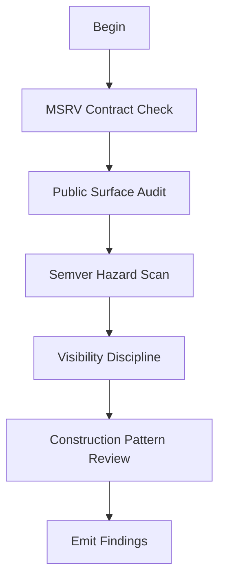

# M09: API Design and Semver

```yaml
module_id: M09
domain: api_contract
inputs: [ChangeSetBundle, InvariantMap]
outputs: [Finding[]]
```

---

## Review Protocol



---

## State: MSRV Contract Check

```yaml
source_of_truth:
  primary: "Cargo.toml: package.rust-version"
  fallback: "documented MSRV policy file (mirrored to rust-version)"

procedure:
  1. read_cargo_toml:
     extract: rust-version
     record: msrv_declared

  2. scan_diff_for:
     - rust_version_bump: "rust-version field changed"
     - new_syntax: ["let-else", "#[diagnostic]", "async fn in trait"]
     - dependency_msrv: "deps with higher MSRV than crate"

  3. verify_ci:
     required_job: "cargo +{msrv} check"
     feature_coverage:
       - default
       - "--no-default-features"

assertions:
  - id: MSRV-DEFINED
    predicate: "rust-version IS_DEFINED for foundational crate"
    on_fail:
      EMIT Finding:
        id: MSRV-001
        severity: BLOCKER
        remediation:
          type: DOC
          specification: "Add rust-version to Cargo.toml"

  - id: MSRV-BUMP
    predicate: |
      IF rust_version_bumped THEN
        binding_requirement_exists AND
        migration_note_exists
    on_fail:
      EMIT Finding:
        id: MSRV-002
        severity: BLOCKER
        remediation:
          type: DOC
          specification: "Add ticket reference and migration note for MSRV bump"

  - id: MSRV-TRANSITIVE
    predicate: "new_dependency.msrv <= crate.msrv"
    on_fail:
      EMIT Finding:
        id: MSRV-003
        severity: BLOCKER
        remediation:
          type: CODE
          specification: "Use dependency compatible with declared MSRV"

  - id: MSRV-CI
    predicate: "ci_has_msrv_job WITH feature_coverage"
    on_fail:
      EMIT Finding:
        id: MSRV-004
        severity: BLOCKER
        remediation:
          type: CI
          specification: "Add MSRV CI job with default and no-default-features"

edge_cases:
  - proc_macro_msrv: "Verify proc-macro dependencies separately"
  - workspace_divergence: "Flag undocumented workspace vs crate MSRV differences"
```

---

## State: Public Surface Audit

```yaml
scan_for:
  - new_public: "pub type|trait|fn|const|static"
  - signature_changes: "fn signature modified"
  - behavior_changes: "semantics altered"
  - feature_gated: "pub behind cfg(feature)"

assertions:
  - id: PUB-DOC
    predicate: |
      FOR EACH new_public_item:
        documentation_exists
    on_fail:
      severity: MAJOR
      remediation: "Add documentation for public item"

  - id: PUB-EXAMPLE
    predicate: |
      FOR EACH significant_public_api:
        example_or_doctest_exists
    on_fail:
      severity: MAJOR
      remediation: "Add usage example"

  - id: PUB-TEST
    predicate: |
      FOR EACH new_behavior:
        test_locks_behavior
    on_fail:
      severity: MAJOR
      remediation: "Add test that verifies expected behavior"
```

---

## State: Semver Hazard Scan

```yaml
hazard_patterns:
  - id: SEM-RESOLUTION
    pattern: "trait impl addition changing method resolution"
    severity: MAJOR

  - id: SEM-BLANKET
    pattern: "blanket impl overlapping downstream"
    severity: BLOCKER
    holonic_constraint: SECLUSION_BREACH

  - id: SEM-BOUNDS
    pattern: "trait bounds tightened"
    severity: MAJOR

  - id: SEM-GENERIC
    pattern: "default generic parameter changed"
    severity: MAJOR

  - id: SEM-FIELD
    pattern: "pub field visibility changed"
    severity: BLOCKER

  - id: SEM-AUTO
    pattern: "auto-trait impl changed (Send/Sync/Unpin)"
    severity: BLOCKER

assertions:
  FOR EACH hazard_detected:
    EMIT Finding:
      id: SEM-{hazard_type}
      severity: {pattern.severity}
      remediation:
        type: DOC
        specification: |
          Provide explicit justification
          AND migration guidance for downstream users
```

---

## State: Visibility Discipline

```yaml
principles:
  - minimize_pub: "Only expose what's necessary"
  - prefer_pub_crate: "Use pub(crate) for internal wiring"
  - no_accidental_pub: "Avoid exposing implementation details"

assertions:
  - id: VIS-MIN
    predicate: "new pub items are intentional and necessary"
    on_fail:
      severity: MINOR
      remediation: "Consider reducing visibility"

  - id: VIS-INTERNAL
    predicate: "internal wiring uses pub(crate)"
    on_fail:
      severity: MINOR
      remediation: "Use pub(crate) instead of pub"

  - id: VIS-ACCIDENT
    predicate: "no implementation details accidentally pub"
    on_fail:
      severity: MAJOR
      holonic_constraint: SECLUSION_BREACH
      remediation: "Hide implementation detail or document as API"
```

---

## State: Construction Pattern Review

```yaml
IF type_has_invariants:
  assertions:
    - id: CTOR-BUILDER
      predicate: |
        uses_builder_pattern OR
        uses_typestate OR
        uses_validated_constructor
      preferred: true
      on_fail:
        severity: MAJOR
        remediation: "Use builder, typestate, or validated constructor"

    - id: CTOR-MUTATE
      predicate: "NOT construct_then_mutate_to_validity"
      on_fail:
        severity: MAJOR
        remediation: "Ensure validity at construction time"

    - id: CTOR-PUB-FIELD
      predicate: |
        IF has_invariants THEN
          NOT exposes_pub_fields
      on_fail:
        EMIT Finding:
          id: API-CTOR-001
          severity: MAJOR
          remediation:
            type: CODE
            specification: "Hide fields behind accessor methods"
```

---

## Output Schema

```typescript
interface APIFinding extends Finding {
  semver_hazard?: SemverHazard;
  visibility_issue?: VisibilityIssue;
  msrv_issue?: MSRVIssue;
}

type SemverHazard =
  | "RESOLUTION_CHANGE"
  | "BLANKET_OVERLAP"
  | "BOUNDS_TIGHTENED"
  | "GENERIC_DEFAULT"
  | "FIELD_VISIBILITY"
  | "AUTO_TRAIT_CHANGE";

type MSRVIssue =
  | "UNDEFINED"
  | "BUMPED_WITHOUT_TICKET"
  | "TRANSITIVE_VIOLATION"
  | "CI_MISSING";
```
