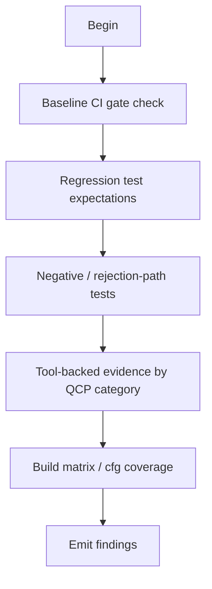

# M10: Testing evidence and CI (Proof surface)

```yaml
module_id: M10
domain: verification
inputs: [ChangeSetBundle, QCP_Result]
outputs: [Finding[]]
```

---

## Purpose

This module answers a single question:

> **Is there enough independent evidence to believe the change is correct under the supported matrix?**

Where evidence is missing, this module fails closed for QCP.

---

## Review protocol



---

## Baseline CI gate check (APM2 reality)

APM2 has a canonical “single entrypoint” for local CI: `scripts/ci/run_local_ci_orchestrator.sh`.

```yaml
baseline_expected_gates_for_rust_changes:
  - rustfmt: "cargo fmt --check"
  - clippy: "cargo clippy ... -D warnings"
  - docs: "cargo doc -D warnings"
  - unit_integration: "cargo nextest run (or cargo test) with workspace defaults"
  - doctests: "cargo test --doc"
  - msrv: "cargo +<MSRV> check --workspace --all-features (if rust-version is set)"
  - supply_chain:
      - "cargo deny check all"
      - "cargo audit (with explicit ignores documented)"

assertions:
  - id: CI-BASELINE-001
    predicate: |
      IF diff.touches_rust_code THEN
        ci_evidence.includes_all(baseline_expected_gates_for_rust_changes)
    on_fail:
      EMIT Finding:
        id: CI-BASELINE-001
        severity: MAJOR
        remediation:
          type: CI
          specification: "Run/attach the canonical CI suite (or equivalent checks) and include logs/artifacts."
```

Escalation rule:

- If `qcp.qcp == true` and baseline gates are missing → severity becomes **BLOCKER**.

---

## Regression test expectations

```yaml
for_new_behavior:
  requirements:
    - id: TEST-REGRESSION-001
      predicate: "a regression test exists that fails without the change"
      on_fail:
        severity: MAJOR
        remediation: "Add a regression test that fails on the previous behavior."

    - id: TEST-REGRESSION-002
      predicate: "tests cover likely regression axes (boundaries + error paths)"
      on_fail:
        severity: MAJOR
        remediation: "Add boundary + error-case tests."

anti_patterns:
  - id: ANTITEST-PANIC
    pattern: "test only asserts code does not panic"
    on_match:
      severity: MAJOR
      remediation: "Assert observable behavior and invariants, not the absence of panic."

  - id: ANTITEST-TAUTOLOGY
    pattern: "test duplicates implementation logic"
    on_match:
      severity: MAJOR
      remediation: "Test against a spec/reference model, not a copy of the code."
```

---

## Security negative tests (fail-closed)

```yaml
requirements:
  - id: TEST-SEC-NEG-001
    predicate: |
      IF qcp.categories contains SECURITY_CRITICAL_PATH OR PROTOCOL_PERSISTENCE THEN
        negative_test_exists_for_rejection_path
    on_fail:
      severity: MAJOR
      remediation: "Add a negative test proving rejection of invalid inputs / invalid authority."

escalation:
  IF qcp.qcp == true AND requirement TEST-SEC-NEG-001 fails:
    severity: BLOCKER
```

---

## Tool-backed evidence by QCP category

### SOUNDNESS_MEMORY

```yaml
requirements:
  - id: TOOL-MIRI-001
    predicate: |
      IF qcp.categories contains SOUNDNESS_MEMORY THEN
        tool_evidence.includes("miri") OR approved_waiver_exists
    on_fail:
      EMIT Finding:
        id: TOOL-MIRI-001
        severity: BLOCKER
        remediation:
          type: TEST
          specification: "Add Miri coverage for the unsafe/memory-critical paths (or document an approved waiver)."
```

### CONCURRENCY_ASYNC

```yaml
requirements:
  - id: TOOL-LOOM-001
    predicate: |
      IF qcp.categories contains CONCURRENCY_ASYNC AND change_introduces_custom_sync THEN
        loom_tests_exist OR approved_waiver_exists
    on_fail:
      severity: MAJOR
      remediation: "Add Loom model tests for concurrency primitives (or document why not applicable)."
```

Escalation: if QCP and custom synchronization is introduced → missing Loom is **BLOCKER**.

### PROTOCOL_PERSISTENCE

```yaml
requirements:
  - id: TOOL-FUZZ-001
    predicate: |
      IF qcp.categories contains PROTOCOL_PERSISTENCE AND parses_untrusted_bytes THEN
        (fuzz_harness_exists OR property_tests_exist) OR approved_waiver_exists
    on_fail:
      severity: MAJOR
      remediation: "Add fuzzing and/or property tests for parser/decoder; enforce size/depth caps."
```

---

## Build matrix / cfg coverage

```yaml
assertions:
  - id: CI-CFG-001
    predicate: |
      FOR EACH new cfg(...) branch:
        ci_builds_at_least_once
    on_fail:
      EMIT Finding:
        id: CI-CFG-001
        severity: BLOCKER
        remediation:
          type: CI
          specification: "Add CI coverage for new cfg/feature branches (no dark code)."
```

---

## Output schema

```typescript
interface TestingFinding extends Finding {
  test_issue?: TestIssue;
  ci_gap?: CIGap;
  tool_gap?: ToolGap;
}

type TestIssue =
  | "MISSING_REGRESSION"
  | "ANTI_PATTERN"
  | "MISSING_NEGATIVE_TEST";

type ToolGap =
  | "MISSING_MIRI"
  | "MISSING_LOOM"
  | "MISSING_FUZZ_OR_PROPERTY";

type CIGap =
  | "CFG_UNCOVERED"
  | "BASELINE_GATES_MISSING";
```
