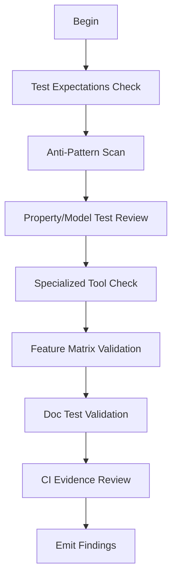

# M10: Testing Evidence and CI

```yaml
module_id: M10
domain: verification
inputs: [ChangeSetBundle, QCP_Result]
outputs: [Finding[]]
```

---

## Review Protocol



---

## State: Test Expectations Check

```yaml
for_new_behavior:
  requirements:
    - id: TEST-FAIL
      predicate: "test exists that fails without change"
      on_fail:
        severity: MAJOR
        remediation: "Add regression test"

    - id: TEST-REGRESS
      predicate: "test catches likely regression"
      on_fail:
        severity: MAJOR
        remediation: "Add regression prevention test"

for_allocator_changes:
  requirements:
    - boundary_sizes: true
    - alloc_free_cycles: true
    - stale_handle_behavior: true
    - drop_discipline: true
    - out_of_range_handling: true
```

---

## State: Anti-Pattern Detection

```yaml
reject_tests_that:
  - id: ANTITEST-PANIC
    pattern: "only asserts code does not panic"
    on_match:
      severity: MAJOR
      remediation: "Assert specific behavior, not absence of panic"

  - id: ANTITEST-HAPPY
    pattern: "tests only happy path"
    on_match:
      severity: MAJOR
      remediation: "Add error case and edge case tests"

  - id: ANTITEST-SNAPSHOT
    pattern: "snapshot without behavioral meaning"
    on_match:
      severity: MINOR
      remediation: "Assert behavioral properties, not just output shape"

  - id: ANTITEST-TAUTOLOGY
    pattern: "duplicates implementation logic"
    on_match:
      severity: MAJOR
      remediation: "Test against specification, not implementation"
```

---

## State: Property/Model Test Review

```yaml
for_allocators_and_state_machines:
  strong_recommendation:
    - "generate random operation sequences"
    - "compare against reference model"
    - "enforce invariants after every step"

  reference_models:
    slab: "Vec<Option<T>>"
    bump_arena: "no-reuse Vec"
    pool: "HashSet of allocated"

assertions:
  - id: PROP-ALLOC
    predicate: |
      IF changes_core_allocator_invariants THEN
        property_tests_exist
    on_fail:
      severity: MAJOR_OR_BLOCKER  # depends on risk/history
      remediation: "Add property-based tests with reference model"
```

---

## State: Specialized Tool Requirements

```yaml
miri_coverage:
  trigger: "QCP touches unsafe memory behavior"
  requirement: "Miri CI job exists and covers path"
  on_missing:
    severity: MAJOR
    remediation: "Add Miri coverage for unsafe paths"

fuzz_harness:
  trigger: "QCP touches parser/decoder"
  requirement: "Fuzz harness exists"
  on_missing:
    severity: MAJOR
    remediation: "Add fuzz harness for parser"

loom_tests:
  trigger: "QCP touches concurrency"
  requirement: "Loom tests exist"
  on_missing:
    severity: MAJOR
    remediation: "Add loom-based concurrency tests"

proposal_rule:
  IF tools_not_in_ci AND risk_justifies:
    action: "Propose as follow-on gate"
```

---

## State: Feature Matrix Validation

```yaml
minimum_required_ci_sets:
  - "--no-default-features"
  - "--all-features"
  - "default (implicit)"
  - "minimal supported set (if defaults heavy)"

complex_feature_rules:
  - id: FEAT-POWERSET
    predicate: |
      IF feature_count <= 8 THEN
        powerset_testing OR justification_documented
    on_fail:
      severity: MAJOR
      remediation: "Add cargo-hack --feature-powerset or document why not"

  - id: FEAT-PAIRWISE
    predicate: |
      IF feature_count > 8 THEN
        pairwise_testing AND problematic_combos_tested
    on_fail:
      severity: MAJOR
      remediation: "Add pairwise testing with known problematic combos"

additivity_check:
  - id: FEAT-ADDITIVE
    predicate: "features do not silently change semantics"
    on_fail:
      severity: MAJOR
      remediation: "Document semantic changes or add feature-specific tests"

dark_code_rule:
  - id: CFG-COVERAGE
    predicate: |
      FOR EACH new cfg(...) branch:
        ci_builds_at_least_once
    on_fail:
      EMIT Finding:
        id: CI-CFG-001
        severity: BLOCKER
        remediation:
          type: CI
          specification: "Add CI job exercising new cfg branch"
```

---

## State: Doc Test Validation

```yaml
required_checks:
  - command: "cargo test --doc"
    status: must_pass

  - command: "cargo doc --deny warnings"
    status: should_pass

  - feature_gated_examples:
      predicate: "compile under relevant feature sets"

edge_cases:
  - id: DOC-COMPILE-FAIL
    predicate: "compile_fail doctests used intentionally and minimally"
    on_fail:
      severity: MINOR
      remediation: "Prefer explicit negative tests over compile_fail"

  - id: DOC-IGNORE
    predicate: |
      cfg OR ignore annotations have justification in doc comment
    on_fail:
      severity: MINOR
      remediation: "Document why example is ignored"

severity_rules:
  doctest_failures:
    default: MAJOR
    foundational_public_api: BLOCKER
```

---

## State: CI Evidence Review

```yaml
verification_checklist:
  - formatting_checks: passed
  - clippy_warnings_as_errors: enforced
  - tests_relevant_targets: covered
  - tests_relevant_features: covered
  - doc_builds: clean

ci_locations:
  github_actions: ".github/workflows/*.yml"
  gitlab_ci: ".gitlab-ci.yml"
  common_names: ["ci.yml", "ci.yaml", "test.yml", "rust.yml"]

assertions:
  - id: CI-COVERAGE
    predicate: |
      FOR EACH changed_code_path:
        ci_builds_and_tests_path
    on_fail:
      EMIT Finding:
        id: CI-COVERAGE-001
        severity: BLOCKER
        remediation:
          type: CI
          specification: "Add CI coverage for changed code paths"

  - id: CI-QCP
    predicate: |
      IF qcp_change THEN
        specialized_gates_exist (bench/fuzz/miri/loom)
    on_fail:
      severity: MAJOR
      remediation: "Add specialized CI gates for QCP changes"
```

---

## Output Schema

```typescript
interface TestingFinding extends Finding {
  test_issue?: TestIssue;
  ci_gap?: CIGap;
  feature_matrix_issue?: FeatureMatrixIssue;
}

type TestIssue =
  | "MISSING_REGRESSION"
  | "ANTI_PATTERN"
  | "MISSING_PROPERTY_TEST"
  | "MISSING_SPECIALIZED_TOOL";

type CIGap =
  | "CFG_UNCOVERED"
  | "FEATURE_UNCOVERED"
  | "QCP_UNVERIFIED"
  | "DOCTEST_FAILING";
```
