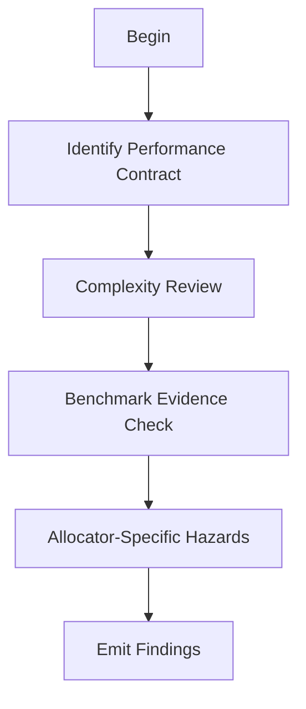

# M11: Performance Review

```yaml
module_id: M11
domain: performance
inputs: [ChangeSetBundle, QCP_Result]
outputs: [Finding[]]
precondition: qcp.categories.includes(PERFORMANCE) OR diff.touches_hot_path
```

---

## Review Protocol



---

## State: Identify Performance Contract

```yaml
determine:
  - hot_paths: "expected frequently-executed code"
  - usage_pattern: "expected workload characteristics"
  - optimization_priority:
      options:
        - throughput
        - tail_latency
        - memory_footprint
        - predictability

output:
  performance_contract:
    hot_paths: Path[]
    priority: OptimizationPriority
    documented: boolean
```

---

## State: Complexity Review

```yaml
assertions:
  - id: PERF-REGRESS
    predicate: "hot path algorithm complexity NOT regressed"
    examples:
      regression: "O(1) -> O(n)"
      ok: "O(n) -> O(n) with smaller constant"
    on_fail:
      EMIT Finding:
        id: PERF-COMPLEXITY-001
        severity: BLOCKER
        remediation:
          type: CODE
          specification: "Restore original complexity or justify regression"

  - id: PERF-ALLOC
    predicate: "hot path does NOT introduce hidden allocation"
    patterns:
      - ".collect() in hot loop"
      - "format!() in hot path"
      - "Box::new in tight loop"
    on_fail:
      EMIT Finding:
        id: PERF-ALLOC-001
        severity: MAJOR
        remediation:
          type: CODE
          specification: "Remove allocation from hot path or justify"

  - id: PERF-COPY
    predicate: "no unjustified clones/copies introduced"
    on_fail:
      EMIT Finding:
        id: PERF-COPY-001
        severity: MAJOR
        remediation:
          type: CODE
          specification: "Remove unnecessary clone or justify"
```

---

## State: Benchmark Evidence Check

```yaml
for_qcp_performance_changes:
  acceptable_evidence:
    - benchmark_artifact: "CI artifact or referenced run"
    - rationale: "Strong reasoning why regression impossible"
    - protective_test: "Invariant defending performance (rare)"

  unacceptable:
    - id: PERF-INLINE
      pattern: "#[inline] as substitute for measurement"
      on_match:
        severity: MAJOR
        remediation: "Provide benchmark evidence"

    - id: PERF-CLAIM
      pattern: "should be faster without evidence"
      on_match:
        severity: MAJOR
        remediation: "Provide benchmark comparison"

assertions:
  - id: PERF-EVIDENCE
    predicate: |
      IF qcp_performance_change THEN
        benchmark_evidence OR strong_rationale
    on_fail:
      EMIT Finding:
        id: PERF-EVIDENCE-001
        severity: MAJOR
        remediation:
          type: TEST
          specification: "Add benchmark or provide detailed rationale"
```

---

## State: Allocator-Specific Performance Hazards

```yaml
IF diff.touches_allocator:
  scan_for:
    - id: ALLOC-SHARE
      pattern: "frequently mutated atomics/fields"
      hazard: "false sharing"
      on_match:
        severity: MAJOR
        remediation: "Add cache line padding or restructure"

    - id: ALLOC-CACHE
      pattern: "freelist with poor locality"
      hazard: "cacheline thrash"
      on_match:
        severity: MAJOR
        remediation: "Improve freelist structure for locality"

    - id: ALLOC-BRANCH
      pattern: "branch-heavy allocation path"
      hazard: "branch misprediction"
      on_match:
        severity: MINOR
        remediation: "Consider branchless alternatives"

    - id: ALLOC-ZERO
      pattern: "unnecessary zeroing on fast path"
      hazard: "wasted cycles"
      on_match:
        severity: MAJOR
        remediation: "Defer or eliminate zeroing"
```

---

## Output Schema

```typescript
interface PerformanceFinding extends Finding {
  complexity_issue?: ComplexityIssue;
  allocator_hazard?: AllocatorHazard;
  evidence_gap?: boolean;
}

type ComplexityIssue =
  | "REGRESSION"
  | "HIDDEN_ALLOCATION"
  | "UNNECESSARY_COPY";

type AllocatorHazard =
  | "FALSE_SHARING"
  | "CACHE_THRASH"
  | "BRANCH_HEAVY"
  | "UNNECESSARY_ZERO";
```
