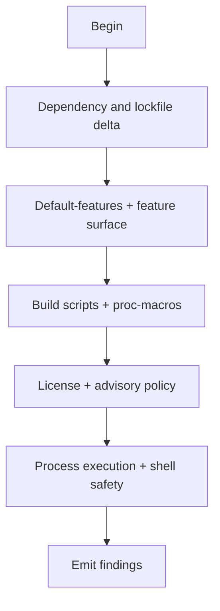

# M12: Dependency and build surface (Supply chain)

```yaml
module_id: M12
domain: supply_chain
inputs: [ChangeSetBundle, QCP_Result]
outputs: [Finding[]]
```

---

## Purpose

In APM2, dependencies and build-time execution are part of the trusted computing base.
This module is intentionally conservative.

Triggers that are presumptive QCP:
- new dependencies,
- lockfile churn,
- build scripts / proc-macros,
- spawning external processes.

---

## Review protocol



---

## State: Dependency and lockfile delta

```yaml
IF diff.adds_or_changes_dependency:
  requirements:
    - id: DEP-JUSTIFY
      predicate: "rationale provided (what capability is missing without it)"
      on_fail:
        EMIT Finding:
          id: DEP-JUSTIFY-001
          severity: MAJOR
          remediation:
            type: DOC
            specification: "Document why the dependency is needed and why std/Existing deps are insufficient."

    - id: DEP-ALTS
      predicate: "alternatives considered (at least: std, existing workspace crates, smaller deps)"
      on_fail:
        EMIT Finding:
          id: DEP-ALTS-001
          severity: MINOR
          remediation:
            type: DOC
            specification: "List considered alternatives and tradeoffs."

    - id: DEP-RISK
      predicate: |
        IF dependency.is_proc_macro OR dependency.has_build_script THEN
          elevated_risk_acknowledged AND mitigation_plan_exists
      on_fail:
        EMIT Finding:
          id: DEP-RISK-001
          severity: MAJOR
          remediation:
            type: DOC
            specification: "Acknowledge proc-macro/build-script risk; document mitigation + CI coverage."

IF diff.changes_Cargo_lock_significantly:
  requirements:
    - id: LOCK-RATIONALE
      predicate: "lockfile churn explained (what dependency changed and why)"
      on_fail:
        EMIT Finding:
          id: LOCK-001
          severity: MAJOR
          remediation:
            type: DOC
            specification: "Explain lockfile churn; avoid drive-by updates."
```

---

## State: Default-features and feature surface

```yaml
for_foundational_crates:
  requirements:
    - id: DEP-DEFAULTS
      predicate: |
        IF enables_default_features THEN
          justification_documented
      on_fail:
        EMIT Finding:
          id: DEP-DEFAULTS-001
          severity: MAJOR
          remediation:
            type: DOC
            specification: "Prefer `default-features = false`; explicitly enable only required features."

recommended_pattern:
  cargo_toml: |
    [dependencies]
    foo = { version = "1.0", default-features = false, features = ["needed"] }
```

---

## State: Build scripts and proc-macros

```yaml
IF diff.adds_or_modifies(build.rs OR proc_macro):
  auto_qcp: true

  requirements:
    - id: BUILD-DETERM
      predicate: "deterministic outputs; no network; declared inputs only"
      on_fail:
        EMIT Finding:
          id: BUILD-001
          severity: BLOCKER
          holonic_constraint: BOUNDARY_INTEGRITY
          remediation:
            type: CODE
            specification: "Remove network/ambient dependency; restrict to Cargo-declared inputs and deterministic outputs."

    - id: BUILD-SCOPE
      predicate: "tight scope (minimal code, minimal deps, clear purpose)"
      on_fail:
        EMIT Finding:
          id: BUILD-002
          severity: MAJOR
          remediation:
            type: CODE
            specification: "Minimize build/proc-macro scope and dependency graph."

    - id: BUILD-DOC
      predicate: "generated artifacts documented; rerun-if-* used correctly"
      on_fail:
        EMIT Finding:
          id: BUILD-003
          severity: MAJOR
          remediation:
            type: DOC
            specification: "Document what is generated and ensure correct rerun triggers."
```

---

## State: License and advisory policy (cargo-deny / cargo-audit)

APM2 contains a `deny.toml` policy and CI expects dependency governance gates.

```yaml
requirements:
  - id: LICENSE-001
    predicate: "cargo-deny policy exists and is enforced"
    on_fail:
      EMIT Finding:
        id: LICENSE-001
        severity: BLOCKER
        remediation:
          type: CI
          specification: "Add/restore cargo-deny enforcement (license + bans + sources)."

  - id: ADVISORY-001
    predicate: "cargo-audit (or equivalent) is enforced with explicit ignores documented"
    on_fail:
      EMIT Finding:
        id: ADVISORY-001
        severity: BLOCKER
        remediation:
          type: CI
          specification: "Add/restore advisory scanning; document any ignores with rationale and expiry."
```

---

## State: Process execution and shell safety

This covers `std::process::Command`, `sh -c`, and any host-command invocation.

```yaml
IF diff.spawns_process:
  auto_qcp: true

  requirements:
    - id: PROC-NO-SHELL
      predicate: "does not invoke a shell (no `sh -c`, no stringly-typed pipelines)"
      on_fail:
        EMIT Finding:
          id: PROC-001
          severity: BLOCKER
          remediation:
            type: CODE
            specification: "Use `Command` with explicit argv; never use a shell for composition."

    - id: PROC-ARGS
      predicate: "untrusted or complex strings are not passed as argv fragments"
      on_fail:
        EMIT Finding:
          id: PROC-002
          severity: BLOCKER
          remediation:
            type: CODE
            specification: "Pass data via stdin/temp files; keep argv structured and non-ambiguous."

    - id: PROC-ENV
      predicate: "explicit environment management (clear or allowlist; do not inherit secrets by default)"
      on_fail:
        EMIT Finding:
          id: PROC-003
          severity: MAJOR
          remediation:
            type: CODE
            specification: "Clear env and re-add an allowlist; never inherit tokens/credentials implicitly."

    - id: PROC-HEADLESS
      predicate: "verified non-interactive behavior (no hangs; bounded timeouts; deterministic outputs)"
      on_fail:
        EMIT Finding:
          id: PROC-004
          severity: MAJOR
          remediation:
            type: TEST
            specification: "Add a headless-mode test; ensure timeouts and non-interactive operation."
```

---

## Output schema

```typescript
interface DependencyFinding extends Finding {
  dependency_issue?: DependencyIssue;
  license_issue?: LicenseIssue;
  build_issue?: BuildIssue;
  process_issue?: ProcessIssue;
}

type DependencyIssue =
  | "UNJUSTIFIED"
  | "NO_ALTERNATIVES_ANALYSIS"
  | "ELEVATED_RISK"
  | "LOCKFILE_CHURN";

type LicenseIssue =
  | "NO_VERIFICATION"
  | "INCOMPATIBLE"
  | "UNKNOWN"
  | "ADVISORY_UNCHECKED";

type BuildIssue =
  | "NONDETERMINISTIC"
  | "NETWORK_ACCESS"
  | "UNDOCUMENTED_OUTPUT";

type ProcessIssue =
  | "SHELL_INVOCATION"
  | "ARGUMENT_INJECTION"
  | "ENVIRONMENT_BLEED"
  | "HEADLESS_FAILURE";
```
