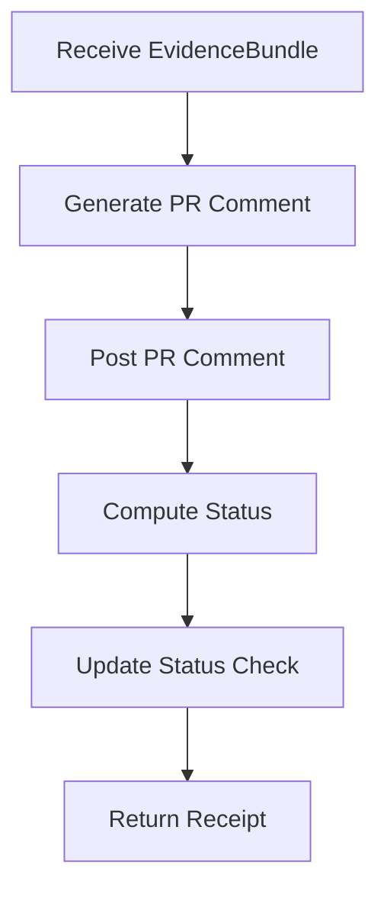

# M14: Required Actions

```yaml
module_id: M14
domain: output_actions
inputs: [EvidenceBundle, PR_URL, HEAD_SHA]
outputs: [PRComment, StatusCheck]
```

---

## Action Sequence



---

## Action 1: Post PR Comment

```yaml
command_template: |
  gh pr comment $PR_URL --body "$(cat <<'EOF'
  ## Code Quality Review

  **QCP:** {qcp_status} — {qcp_justification}

  **Scope Reviewed:**
  - Subsystems: {subsystems}
  - Public API changes: {public_api_changes}
  - Unsafe/Concurrency/Performance: {qcp_surfaces}

  **Evidence Verified (CI):**
  - Checks passed: {ci_checks}
  - Coverage gaps: {coverage_gaps}

  **Findings:**
  {findings_formatted}

  **Positive Observations:**
  {positive_observations}

  **Verdict:** {verdict}
  EOF
  )"

findings_format:
  FOR EACH finding:
    template: |
      - **[{severity}]** `{location}`
        - Issue: {issue_description}
        - Required remediation: {remediation}
        - Proof requirement: {proof_type}

rules:
  - proof_required_for: [BLOCKER, MAJOR]
  - failure_reason_explicit: true
  - failure_reason_minimal: true
```

---

## Action 2: Review Gate Evaluation

```yaml
status_decision:
  NOTE: |
    Direct status writes have been removed. The Review Gate Success workflow
    (.github/workflows/review-gate.yml) evaluates machine-readable metadata
    from PR comments via the Forge Admission Cycle workflow and posts the authoritative
    "Review Gate Success" commit status.

  IF verdict == PASS:
    effect: "Review Gate Success workflow will post success status"

  ELSE IF verdict == FAIL:
    effect: "Review Gate Success workflow will post failure status"

  ELSE IF verdict == BLOCKED:
    effect: "Review Gate Success workflow will remain in pending state"
```

---

## Execution Protocol

```yaml
execution_order:
  1. post_pr_comment:
     required: true
     purpose: "actionable record for author"

  2. update_status_check:
     required: true
     purpose: "merge gate"

invariants:
  - both_commands_executed: true
  - pr_comment_is_record: true
  - status_check_is_gate: true
```

---

## Output Receipt

```yaml
receipt_schema:
  type: MergeReceipt | FindingReport

  MergeReceipt:
    verdict: PASS
    pr_url: string
    head_sha: string
    evidence_bundle_digest: string
    timestamp: ISO8601

  FindingReport:
    verdict: FAIL | BLOCKED
    pr_url: string
    head_sha: string
    blocker_count: int
    major_count: int
    evidence_bundle_digest: string
    timestamp: ISO8601
```

---

## Comment Template (Full)

```markdown
## Code Quality Review

**QCP:** YES — Touches unsafe allocator code

**Scope Reviewed:**
- Subsystems: `arena`, `pool`, `handle`
- Public API changes: Yes
- Unsafe/Concurrency/Performance: Yes/No/Yes

**Evidence Verified (CI):**
- Checks passed: clippy, test, miri
- Coverage gaps: no `--no-default-features` job

**Findings:**
- **[BLOCKER]** `src/arena.rs:142:unsafe_block`
  - Issue: Missing // SAFETY: comment
  - Required remediation: Add safety comment documenting invariants
  - Proof requirement: DOC

- **[MAJOR]** `src/pool.rs:89:allocate`
  - Issue: Unchecked multiplication may overflow
  - Required remediation: Use checked_mul
  - Proof requirement: CODE + TEST

**Positive Observations:**
- Clean separation of typed and untyped arenas
- Good use of generational handles

**Verdict:** FAIL
```

---

## PCAC: When to Use It

```yaml
pcac_required_for_handlers:
  predicate: |
    handler performs authority-bearing side effects
  examples:
    - "issues/delegates/revokes capabilities or leases"
    - "records authoritative review/security receipts"
    - "executes tool/process/network effects under privileged authority"
    - "writes authoritative ledger events that change admission state"
  required_lifecycle:
    - join
    - revalidate
    - consume
    - effect
  reviewer_default:
    missing_lifecycle_severity: MAJOR
    finding_text: "Handler has authority-bearing side effects but no AJC lifecycle."
```

---

## PCAC Pre-Commit Template (Authority-Bearing Handlers)

```yaml
pre_commit_pcac_checklist:
  1_builder:
    required: true
    check: "Use PrivilegedPcacInputBuilder (or module-equivalent canonical builder) for join input assembly."

  2_lifecycle_calls:
    required: true
    check: "Run canonical lifecycle before effect: join -> revalidate -> consume."

  3_fail_closed_wiring:
    required: true
    check: "If PCAC gate/policy/freshness inputs are missing, deny request (no bypass)."

  4_intent_equality:
    required: true
    check: "Recompute effect intent at consume boundary and deny on mismatch."

  5_durable_evidence:
    required: true
    check: "Persist lifecycle selectors (e.g., ajc_id, consume_tick, selector digest) on authoritative event payload."

  6_test_obligations:
    required: true
    check:
      - "test: missing gate wiring denies"
      - "test: stale/missing revalidation input denies"
      - "test: duplicate consume/replay denies"
      - "test: intent mismatch denies"
```
